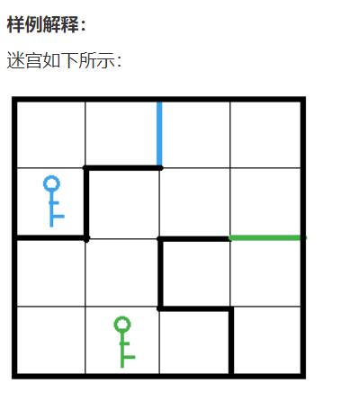
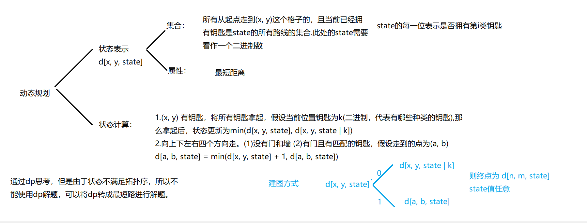

# 图论

（树是一种特殊的图（无回路的无向连通图））

[TOC]


## 图的定义

​	图是由顶点的有穷非空集合和顶点之间的边的集合组成，通常表示为：G(V,E)

​	图中的边分为有向边和无向边

​	无向边：若顶点Vi到顶点Vj之间的边没有方向则称这条边为无向边，用(Vi,Vj)表示.

​	有向边：若顶点Vi到顶点Vj之间的边有方向则称这条边为有向边，用<Vi,Vj>表示.

​	无向图：如果图中任意两顶点之间的边都是无向边，则称该图为无向图.

​	有向图：如果图中任意两顶点之间的边都是有向边，则称改图为有向图.

​	无向完全图：在无向图中任意两顶点之间都存在边，则称为无向完全图.

​	有向完全图：在有向图中，任意两个顶点之间都存在方向护卫相反的两条边，则称该图为有向完全图.

​	含有n个顶点的无向完全图有n(n-1)/2条边.

​	含有n个顶点的有向完全图有n(n-1)条边.

​	带权图通常称为网络.

​	连通： 在无向图G中，如果从顶点v到顶点v'有路径，则称v和v'是连通的.

​	连通图：如果对于图中任意两个顶点vi、vj∈V，vi和vj都是连通的，则称G是连通图（Connected Graph）.

​	连通分量：无向图中的极大连通子图称为连通分量(①子图、②连通子图含极大顶点数、③具有极大顶点数的连通子图包含依附于这些顶点的所有边)

​	强连通图：在有向图G中，如果对于每一对vi、vj∈V、vi≠vj，从vi到vj和从vj到vi都存在路径，则称G是强连通图.

​	强连通分量：有向图中的极大强连通子图称做有向图的强连通分量.

## 图的存储

①邻接矩阵(二维数组)

用于存储稠密图（边较多相对而言）

②邻接表(一个一维数组下标表示对应的起始点(即边的一头)，后面每一维接一个链表存储该点能到达的所有邻接点)

用于存储稀疏图（边较少相对而言），一般情况下而言竞赛中邻接表大多是静态模拟：链式前向星。

## 图的遍历（搜索）

这两种搜索方式可以查看我的博客

[]: https://blog.csdn.net/hk_jhx/article/details/116675186?spm=1001.2014.3001.5501

### ①DFS（深度优先搜索）

输出顶点x到顶点y长度为k的简单路径

```c++
#include <iostream>
#include <cstring>
using namespace std;
const int N=10010;
int h[N] ,e[N] , ne[N], idx;
bool st[N];
void add(int a, int b);
void printpath(int path[], int d);
void findpath(int u, int v ,int w, int d, int path[]);

int main()
{
    int n;//表示有向图中边的个数
    cin >> n;
    memset(h, -1, sizeof h);
    while(n--)
    {
        int a, b;
        cin >> a >> b;
        add(a, b);
    }
    int x, y, k;//表示需要输出简单路径的起始点,简单路径的长度
    cin >> x >> y >> k;
    int path[N];
    findpath(x, y, k, 0, path);
    return 0;
}

void add(int a, int b)
{
    e[idx] = b;
    ne[idx] = h[a];
    h[a] = idx++;
}

void printpath(int path[], int d)
{
    for(int i = 1; i <= d; ++ i)
        cout << path[i] << " ";
    cout<<endl;
}

void findpath(int u, int v ,int w, int d, int path[])
{
    d++;
    path[d] = u;
    st[u] = true;
    if(u == v && w == 0)
        printpath(path, d);
    else if(w > 0)
    {
        for(int i = h[u]; i != -1; i = ne[i])
        {
            int j = e[i];
            if(!st[j])
                findpath(j, v, w-1, d, path);
            st[j] = false;
        }
    }
}
```

n-皇后问题

针对于n-皇后问题每个皇后不可以放在同一行同一列同一斜线上，所以每行只会存在一个皇后，那么我们只需要去枚举每行皇后放的位置将所有合法的方案保存下来即可，类似于全排列问题，我们这里已经分析出每行只会存在一个皇后，我们通过dfs去枚举行，即传递一个参数表示行数，每行我们去枚举0-n列，倘若满足放的条件的话讲dfs(u+1)下一行去搜索，如此枚举所有方案，将合法的方案记录下来。

除了通过每一行去枚举所有方案之外我们还可以直接枚举每一个格子是否可以存放皇后，每个格子有防和不放两种情况，当放皇后的时候我们需要判断是否房租条件，满足条件的情况下才可以放皇后。除了枚举放皇后的位置之外我们同时需要记录已经放置皇后的数量，若是数量=n则不能存放可以得到一个合法方案。


```c++
/*
n−皇后问题是指将 n 个皇后放在 n×n 的国际象棋棋盘上，使得皇后不能相互攻击到，即任意两个皇后都不能处于同一行、同一列或同一斜线上。
现在给定整数 n，请你输出所有的满足条件的棋子摆法。
输入格式
共一行，包含整数 n。
输出格式
每个解决方案占 n 行，每行输出一个长度为 n 的字符串，用来表示完整的棋盘状态。
其中 . 表示某一个位置的方格状态为空，Q 表示某一个位置的方格上摆着皇后。
每个方案输出完成后，输出一个空行。
注意：行末不能有多余空格。
输出方案的顺序任意，只要不重复且没有遗漏即可。
数据范围
1≤n≤9
输入样例：
4
输出样例：
.Q..
...Q
Q...
..Q.

..Q.
Q...
...Q
.Q..
*/
#include <iostream>
#include <cstring>
#include <algorithm>
using namespace std;
const int N = 20;
char g[N][N];
bool col[N], dg[N], udg[N];
int n;
void dfs(int u)
{
    if(u==n)
    {
        for (int i = 0; i < n; i ++ )
            cout<<g[i]<<endl;
        puts("");
        return ;
    }
    for (int i = 0; i < n; i ++ )
    {
        if(!col[i] && !dg[u+i] && !udg[i-u+n])
        {
            col[i]=dg[u+i]=udg[i-u+n]=true;
            g[u][i]='Q';
            dfs(u+1);
            col[i]=dg[u+i]=udg[i-u+n]=false;
            g[u][i]='.';
        }
    }
}
int main()
{
    cin>>n;
    for (int i = 0; i < n; i ++ )
        for (int j = 0; j < n; j ++ )
            g[i][j]='.';
    dfs(0);
    
    return 0;
}


#include <iostream>
#include <cstring>
#include <algorithm>
using namespace std;
const int N = 25;
char g[N][N];
bool row[N], col[N], dg[N], udg[N];
int n;
void dfs(int x, int y, int s)
{
    if(y==n)
    {
        ++x;
        y=0;
    }
    if(x==n)
    {
        if(s==n)
        {
            for (int i = 0; i < n; i ++ )
                cout<<g[i]<<endl;
            cout<<endl;
            return ;
        }
        return ;
    }
    //不放皇后
    dfs(x, y+1, s);
    //放皇后
    if(!row[x] && !col[y] && !dg[y+x] && !udg[y-x+n])
    {
        g[x][y]='Q';
        row[x]=col[y]=true;
        dg[y+x]=udg[y-x+n]=true;
        dfs(x, y+1, s+1);
        g[x][y]='.';
        row[x]=col[y]=false;
        dg[y+x]=udg[y-x+n]=false;
    }
}
int main()
{
    cin>>n;
    for (int i = 0; i < n; i ++ )
        for (int j = 0; j < n; j ++ )
            g[i][j]='.';
    dfs(0, 0, 0);
    
    return 0;
}
```


### ②BFS（广度优先搜索）

$$
\begin{align}
&此处对八数码问题做出解析

\end{align}
$$


```c++
/*
在一个 3×3 的网格中，1∼8 这 8 个数字和一个 x 恰好不重不漏地分布在这 3×3 的网格中。
例如：
1 2 3
x 4 6
7 5 8
在游戏过程中，可以把 x 与其上、下、左、右四个方向之一的数字交换（如果存在）。
我们的目的是通过交换，使得网格变为如下排列（称为正确排列）：
1 2 3
4 5 6
7 8 x
例如，示例中图形就可以通过让 x 先后与右、下、右三个方向的数字交换成功得到正确排列。
交换过程如下：
1 2 3   1 2 3   1 2 3   1 2 3
x 4 6   4 x 6   4 5 6   4 5 6
7 5 8   7 5 8   7 x 8   7 8 x
现在，给你一个初始网格，请你求出得到正确排列至少需要进行多少次交换。
输入格式
输入占一行，将 3×3 的初始网格描绘出来。
例如，如果初始网格如下所示：
1 2 3 
x 4 6 
7 5 8 
则输入为：1 2 3 x 4 6 7 5 8
输出格式
输出占一行，包含一个整数，表示最少交换次数。
如果不存在解决方案，则输出 −1。
输入样例：
2  3  4  1  5  x  7  6  8
输出样例
19
*/
#include <iostream>
#include <algorithm>
#include <unordered_map>
#include <queue>
#include <string>
using namespace std;
int dx[4]={-1,1,0,0},dy[4]={0,0,-1,1};
int bfs(string start);

int main()
{
    string start;
    for(int i=0;i<9;++i)
    {
        char c;
        cin>>c;
        start+=c;
    }
    
    cout<<bfs(start)<<endl;
    
    return 0;
}

int bfs(string start)
{
    string end="12345678x";
    queue<string> q;
    unordered_map<string,  int> d;
    q.push(start);
    d[start]=0;
    
    while(q.size())
    {
        auto t=q.front();
        q.pop();
        int distance=d[t];
        if(t==end)
            return distance;
        //状态转移
        int k=t.find('x');
        int x=k/3,y=k%3;
        for(int i=0;i<4;++i)
        {
            int a=x+dx[i];
            int b=y+dy[i];
            if(a>=0&&a<3&&b>=0&&b<3)
            {
                swap(t[k],t[3*a+b]);
                if(!d.count(t))
                {
                    d[t]=distance+1;
                    q.push(t);
                }
                swap(t[k],t[3*a+b]);
            }
        }
    }
    return -1;
}
```


## 拓扑排序

$$
\begin{align}
&（拓扑图  DAG图）有向无环图，即有向无环图一定存在拓扑序，利用抽屉原理可以证明有向无环图一定存在一个入度为0的点）\\
&BFS的实际应用，并且拓扑序并不唯一.在此不给予证明.\\
&那么如何去实现拓扑排序呢，其实拓扑排序共有如下步骤:\\
&①.将所有起始时入度为0的顶点放入一个集合(注:由于为了方便此处使用数组模拟的队列).\\
&②.当队列不空，出一个顶点，枚举该顶点所有出边，将其做-1操作，即将该顶点的邻接点的入度-1，此时再判断邻接点的入度是否为\\
&\quad \ 0，若为0则进入集合.\\
&③.最后返回集合中是否每一个顶点都出现过(由于此处使用数组模拟的队列，所以仅需要返回是否队尾=顶点个数-1)，即可判断\\
&并且此时可以发现数组模拟的队列中的顺序恰好是拓扑序.(下例题使用邻接表存储图，实际情况若为稠密图则课选择邻接矩阵存储).
\end{align}
$$

```c++
/*
给定一个 n 个点 m 条边的有向图，点的编号是 1 到 n，图中可能存在重边和自环。
请输出任意一个该有向图的拓扑序列，如果拓扑序列不存在，则输出 −1。
若一个由图中所有点构成的序列 A 满足：对于图中的每条边 (x,y)，x 在 A 中都出现在 y 之前，则称 A 是该图的一个拓扑序列。
输入格式
第一行包含两个整数 n 和 m。
接下来 m 行，每行包含两个整数 x 和 y，表示存在一条从点 x 到点 y 的有向边 (x,y)。
输出格式
共一行，如果存在拓扑序列，则输出任意一个合法的拓扑序列即可。
否则输出 −1。
数据范围
1≤n,m≤105
输入样例：
3 3
1 2
2 3
1 3
输出样例：
1 2 3
*/
#include <iostream>
#include <algorithm>
#include <cstring>
using namespace std;
const int N=1e5+10;
int h[N],e[N],ne[N],idx;
int q[N],d[N];
int n,m;
void add(int a,int b);
bool topsort();

int main()
{
    cin>>n>>m;
    memset(h,-1,sizeof h);
    
    while(m--)
    {
        int a,b;
        cin>>a>>b;
        add(a,b);
        ++d[b];
    }
    
    if(topsort())
    {
        for(int i=0;i<n;++i)
            cout<<q[i]<<" ";
    }
    else
        puts("-1");
    return 0;
}

void add(int a,int b)
{
    e[idx]=b;
    ne[idx]=h[a];
    h[a]=idx++;
}

bool topsort()
{
    int hh=0,tt=-1;
    for(int i=1;i<=n;++i)
    {
        if(d[i]==0)
            q[++tt]=i;
    }
    while(hh<=tt)
    {
        int t=q[hh++];
        for(int i=h[t];i!=-1;i=ne[i])
        {
            int j=e[i];
            if(--d[j]==0)
            {
                q[++tt]=j;
            }
        }
    }
    return tt==n-1;
}
```


## 图相关算法


### 单源最短路径问题

#### 一.Dijkstra算法

##### 一.朴素版Dijkstra

$$
\begin{align}
&对于朴素版的Dijkstra算法，当计算稠密图时使用邻接矩阵进行存储，而一般情况下朴素版Dijkstra算法处理的是稠密图.\\
&所以此处我们的例子也是稠密图，首先我们对图中的边进行初始化，边代表的是两个顶点之间得到距离，这里我们再\\
&声明一个dist[N]数组用于表示1-i(1<=i<=N)的2最短距离，那么Dijkstra算法总共有如下几步:\\
&①.首先初始化距离，将dist[1]=0，到其它点的距离初始化为正无穷\\
&②.迭代n次，分两个类顶点一个是已经确定最短距离的顶点放置再一个集合中，另一半是未确定最短距离的顶点\\
&③.每一次迭代从未确定最短距离的顶点中找到距离集合中的任意点，距离最近的一个点，将它加入集合\\
&④.之后通过新加入的点更新到起点的距离.\\
&最后我们判断答案的时候只需要判断一下dist[n]值是无穷大还是一个有效数字.\\
&倘若需要求不从第一个点开始且终点不是n的最短路径又该如何处理呢？\\
&
\end{align}
$$

```c++
/*
给定一个 n 个点 m 条边的有向图，图中可能存在重边和自环，所有边权均为正值。
请你求出 1 号点到 n 号点的最短距离，如果无法从 1 号点走到 n 号点，则输出 −1。
输入格式
第一行包含整数 n 和 m。
接下来 m 行每行包含三个整数 x,y,z，表示存在一条从点 x 到点 y 的有向边，边长为 z。
输出格式
输出一个整数，表示 1 号点到 n 号点的最短距离。
如果路径不存在，则输出 −1。
数据范围
1≤n≤500,
1≤m≤105,
图中涉及边长均不超过10000。
输入样例：
3 3
1 2 2
2 3 1
1 3 4
输出样例：
3
*/
#include <iostream>
#include <algorithm>
#include <cstring>
using namespace std;
const int N=510;
int g[N][N],dist[N];
bool st[N];
int n,m;
int dijkstra();

int main()
{
    cin>>n>>m;
    memset(g,0x3f,sizeof g);
    while(m--)
    {
        int x,y,z;
        cin>>x>>y>>z;
        g[x][y]=min(g[x][y],z);
    }
    int t=dijkstra();
    cout<<t<<endl;
    return 0;
}

int dijkstra()
{
    memset(dist,0x3f,sizeof dist);
    dist[1]=0;
    
    for(int i=0;i<n;++i)
    {
        int t=-1;
        for(int j=1;j<=n;++j)
        {
            if(!st[j]&&(t==-1||dist[t]>dist[j]))
                t=j;
        }
        st[t]=true;
        for(int j=1;j<=n;++j)
        {
            dist[j]=min(dist[j],dist[t]+g[t][j]);
        }
    }
    if(dist[n]==0x3f3f3f3f)
        return -1;
    return dist[n];
}
```

```c++
/*
有了一张自驾旅游路线图，你会知道城市间的高速公路长度、以及该公路要收取的过路费。现在需要你写一个程序，帮助前来咨询的游客找一条出发地和目的地之间的最短路径。如果有若干条路径都是最短的，那么需要输出最便宜的一条路径。
输入格式:
输入说明：输入数据的第1行给出4个正整数N、M、S、D，其中N（2≤N≤500）是城市的个数，顺便假设城市的编号为0~(N−1)；M是高速公路的条数；S是出发地的城市编号；D是目的地的城市编号。随后的M行中，每行给出一条高速公路的信息，分别是：城市1、城市2、高速公路长度、收费额，中间用空格分开，数字均为整数且不超过500。输入保证解的存在。
输出格式:
在一行里输出路径的长度和收费总额，数字间以空格分隔，输出结尾不能有多余空格。
输入样例:
4 5 0 3
0 1 1 20
1 3 2 30
0 3 4 10
0 2 2 20
2 3 1 20
结尾无空行
输出样例:
3 40
结尾无空行
*/
#include <iostream>
#include <algorithm>
#include <cstring>
using namespace std;
const int N=510;
int g[N][N],f[N][N],dist[N],cost[N];
int n,m,s,d;
bool st[N];
void dijkstra(int t);

int main()
{
	scanf("%d%d%d%d",&n,&m,&s,&d);
	memset(g,0x3f,sizeof g);
	memset(f,0x3f,sizeof f);
	while(m--)
	{
		int a,b,x,y;
		scanf("%d%d%d%d",&a,&b,&x,&y);
		g[a][b]=min(g[a][b],x);
		g[b][a]=min(g[b][a],x);
		f[a][b]=min(f[a][b],y);
		f[b][a]=min(f[b][a],y);
	}
	
	dijkstra(s);
	
	cout<<dist[d]<<" "<<cost[d]<<endl;
	
	return 0;
}

void dijkstra(int t)
{
	memset(st,false,sizeof st);
	memset(dist,0x3f,sizeof dist);
	memset(cost,0x3f,sizeof cost);
	dist[t]=0,cost[t]=0;
	for(int i=0;i<n;++i)
	{
		int x=-1;
		for(int j=0;j<n;++j)
		{
			if(!st[j]&&(x==-1||dist[x]>dist[j]))
			{
				x=j;
			}
		}
		
		st[x]=true;
		
		for(int j=0;j<n;++j)
		{
			if(dist[j]>dist[x]+g[x][j])
			{
				dist[j]=dist[x]+g[x][j];
				cost[j]=cost[x]+f[x][j];
			}
			else if(dist[j]==dist[x]+g[x][j])
			{
				if(cost[j]>cost[x]+f[x][j])
				{
					dist[j]=dist[x]+g[x][j];
					cost[j]=cost[x]+f[x][j];
				}
			}
		}
	}
	
}
```

```c++
/*
倘若上方例题需要我们将路径也输出，那么我们便需要将每次加入集合的点记录下来.记录抵达这一点j的上一个路过点t
pre
*/
#include <iostream>
#include <cstring>
#include <algorithm>
#include <vector>
using namespace std;
const int N=510;
int g[N][N],f[N][N],dist[N],cost[N];
bool st[N];
int pre[N];
vector<int> path;
int n,M,S,D;
void dijkstra(int s);

int main()
{
    cin>>n>>M>>S>>D;
    memset(g,0x3f,sizeof g);
    memset(f,0x3f,sizeof f);
    while(M--)
    {
        int a,b,c,d;
        cin>>a>>b>>c>>d;
        g[a][b]=min(g[a][b],c);
        g[b][a]=min(g[b][a],c);
        f[a][b]=min(f[a][b],d);
        f[b][a]=min(f[b][a],d);
    }
    dijkstra(S);
    for(int i=D;i!=S;i=pre[i])//倒着去寻找抵达这一层次点的路径
    {
        path.push_back(i);
    }
    cout<<S<<" ";
    for(int i=path.size()-1;i>=0;--i)
        cout<<path[i]<<" ";
    cout<<dist[D]<<" "<<cost[D]<<endl;
    return 0;
}
void dijkstra(int s)
{
    memset(dist,0x3f,sizeof dist);
    dist[s]=0;
    memset(cost,0x3f,sizeof cost);
    cost[s]=0;
    
    for(int i=0;i<n;++i)
    {
        int t=-1;
        for(int j=0;j<n;++j)
        {
            if(!st[j]&&(t==-1||dist[t]>dist[j]))
                t=j;
        }
        
        st[t]=true;
        
        for(int j=0;j<n;++j)
        {
            if(dist[j]>dist[t]+g[t][j])
            {
                dist[j]=dist[t]+g[t][j];
                cost[j]=cost[t]+f[t][j];
                pre[j]=t;//此处记录的是j是通过t点抵达时为最短路径
            }
            else if(dist[j]==dist[t]+g[t][j])
            {
                if(cost[j]>cost[t]+f[t][j])
                {
                    dist[j]=dist[t]+g[t][j];
                    cost[j]=cost[t]+f[t][j];
                    pre[j]=t;//此处记录的是j是通过t点抵达时为最短路径
                }
            }
        }
    }
}
```


##### 二.堆优化Dijkstra

此处的堆优化需要自己手写堆和操作所以可以参考数据结构中的模拟堆的操作，将Dijkstra的每次需要从不在集合中的其他点放在堆中

这样每次需要选出距离集合中最近的点，仅需要取出小顶堆的堆顶，之后再将堆进行调整即可.

```C++
/*
给定一个 n 个点 m 条边的有向图，图中可能存在重边和自环，所有边权均为非负值。
请你求出 1 号点到 n 号点的最短距离，如果无法从 1 号点走到 n 号点，则输出 −1。
输入格式
第一行包含整数 n 和 m。
接下来 m 行每行包含三个整数 x,y,z，表示存在一条从点 x 到点 y 的有向边，边长为 z。
输出格式
输出一个整数，表示 1 号点到 n 号点的最短距离。
如果路径不存在，则输出 −1。
数据范围
1≤n,m≤1.5×105,
图中涉及边长均不小于 0，且不超过 10000。
数据保证：如果最短路存在，则最短路的长度不超过 109。
输入样例：
3 3
1 2 2
2 3 1
1 3 4
输出样例：
3
*/
#include <iostream>
#include <cstring>
#include <algorithm>
#include <queue>
using namespace std;
typedef pair<int, int> PII;
const int N = 150010, M=N*2;
int h[N], e[M], w[M], ne[M], idx;
int dist[N];
bool st[N];
int n, m;
void add(int a, int b, int c)
{
    e[idx]=b;
    w[idx]=c;
    ne[idx]=h[a];
    h[a]=idx++;
}
int dijkstra()
{
    memset(dist, 0x3f, sizeof dist);
    dist[1]=0;
    priority_queue<PII, vector<PII>, greater<PII>> heap;
    heap.push({0, 1});
    while(heap.size())
    {
        auto t=heap.top();
        heap.pop();
        int ver=t.second, distance=t.first;
        if(st[ver])
            continue;
        st[ver]=true;
        for (int i = h[ver]; i != -1; i = ne[i] )
        {
            int j=e[i];
            if(dist[j]>distance+w[i])
            {
                dist[j]=distance+w[i];
                heap.push({dist[j], j});
            }
        }
    }
    if(dist[n]==0x3f3f3f3f)
        return -1;
    else
        return dist[n];
}

int main()
{
    cin>>n>>m;
    memset(h, -1, sizeof h);
    for (int i = 0; i < m; i ++ )
    {
        int a, b, c;
        cin>>a>>b>>c;
        add(a, b, c);
    }
    int t=dijkstra();
    if(t==0x3f3f3f3f)
        puts("-1");
    else
        cout<<t<<endl;
    return 0;
}
```


#### 二.Bellman-ford算法

$$
\begin{align}
&时间复杂度:O(mn)\\
&Bellman-ford可以处理有负权边的算法，并且其可以判断是否存在负权回路，需注意存在负权回路则不一定存在最短路.\\
& Bellman=ford算法基本处理方式:\\
&①迭代n次\\
&②遍历所有边\\
&③每一次遍历边的操作，对于遍历的到的新边进行一次更新(类似于dijkstra算法)dist[b]=min(dist[b],dist[a]+w)\\
&意为将新加入集合的的节点判断其到其到起点的最短距离是否有所改变.该操作称为松弛操作.\\
&并且bellman-ford算法后续经过证明可得dist[b]<=dist[a]+w，这一不等式称为三角不等式.\\
&注：Bellman-ford算法在迭代更新时可能发生串联，由此我们需要想办法来解决这个问题，之所以为什么会发生串联\\
&是因为在一次迭代中，当题目提供边数小于不限制边数情况下得到的最短路径经过的边数时，此时可能发生枚举一条路径时\\
&会将后续路径上的距离做出修改，那么怎么防止这个操作呢，就是将上一次的迭代结果备份下来，对此次迭代中的枚举使用\\
&上一次迭代的结果.以防止当前遍历所有边时，上一次遍历对dist做出的修改影响到后续dist数组中的值.\\
&操作①中迭代意义:假设迭代到第k次，dist数组的含义，从1号点经过不超过k条边的最短距离.\\
&那么迭代n次并且仍然对dist数组有更新的含义就是存在一条最短路径上有超过或等于n条边.依据抽屉原理可证明路径中\\
&一定存在环，且是一个负环，那么可以依据此方法来判断是否存在负环，但是一般情况下不适用这种方法由于时间复杂度\\
&较高.
\end{align}
$$

```c++
该题有一经过边数限制所以该题需使用Bellman-ford算法，限制经过边数可以有效解决负环问题
/*
给定一个 n 个点 m 条边的有向图，图中可能存在重边和自环， 边权可能为负数。
请你求出从 1 号点到 n 号点的最多经过 k 条边的最短距离，如果无法从 1 号点走到 n 号点，输出 impossible。
注意：图中可能 存在负权回路 。
输入格式
第一行包含三个整数 n,m,k。
接下来 m 行，每行包含三个整数 x,y,z，表示存在一条从点 x 到点 y 的有向边，边长为 z。
输出格式
输出一个整数，表示从 1 号点到 n 号点的最多经过 k 条边的最短距离。
如果不存在满足条件的路径，则输出 impossible。
数据范围
1≤n,k≤500,
1≤m≤10000,
任意边长的绝对值不超过 10000。
输入样例：
3 3 1
1 2 1
2 3 1
1 3 3
输出样例：
3
*/
#include <iostream>
#include <cstring>
#include <algorithm>
using namespace std;
const int N=510,M=10010;
int n,m,k;
int dist[N],backup[N];
struct
{
    int a,b,w;
}edges[M];
void Bellman_ford();

int main()
{
    cin>>n>>m>>k;
    for(int i=0;i<m;++i)
    {
        int x,y,z;
        cin>>x>>y>>z;
        edges[i]={x,y,z};
    }
    Bellman_ford();
    return 0;
}
void Bellman_ford()
{
    memset(dist,0x3f,sizeof dist);
    dist[1]=0;
    for(int i=0;i<k;++i)
    {
        memcpy(backup,dist,sizeof dist);
        for(int j=0;j<m;++j)
        {
            int a=edges[j].a,b=edges[j].b,w=edges[j].w;
            dist[b]=min(dist[b],backup[a]+w);
        }
    }
    if(dist[n]>0x3f3f3f3f/2)
        puts("impossible");
    else
        cout<<dist[n]<<endl;
}
```


#### 三.SPFA算法

$$
\begin{align}
&首先声明spfa算法一定要求图中不存在负环\\
&其次SPFA算法是对Bellman-ford算法的优化,在Bellman-ford算法当中遍历边时每一次都需要更新一次dist数组\\
&但实际上并不需要每一次都做一次更新，应当只有一个点的距离被更新变小了，那么他之后邻接点的距离才会有更新的可能，所\\
&我们可以将被更新距离变小的点存入一个集合，，不需要每一个都更新dist数组，而当前面的点的距离变小再去判断是否更新距离.\\
&另外不难发现SPFA算法和Dijkstra算法很相似，所以在不卡数据的情况下，需要正权图问题SPFA算法也可以解决.
\end{align}
$$

```c++
/*
给定一个 n 个点 m 条边的有向图，图中可能存在重边和自环， 边权可能为负数。
请你求出 1 号点到 n 号点的最短距离，如果无法从 1 号点走到 n 号点，则输出 impossible。
数据保证不存在负权回路。
输入格式
第一行包含整数 n 和 m。
接下来 m 行每行包含三个整数 x,y,z，表示存在一条从点 x 到点 y 的有向边，边长为 z。
输出格式
输出一个整数，表示 1 号点到 n 号点的最短距离。
如果路径不存在，则输出 impossible。
数据范围
1≤n,m≤105,
图中涉及边长绝对值均不超过 10000。
输入样例：
3 3
1 2 5
2 3 -3
1 3 4
输出样例：
2
*/
#include <iostream>
#include <algorithm>
#include <cstring>
#include <queue>
using namespace std;
const int N=1e5+10;
int h[N],e[N],ne[N],w[N],idx;
int dist[N];
bool st[N];
int n,m;
void add(int a,int b,int c);
int spfa();

int main()
{
    cin>>n>>m;
    memset(h,-1,sizeof h);
    
    for(int i=0;i<m;++i)
    {
        int x,y,z;
        cin>>x>>y>>z;
        add(x,y,z);
    }
    
    int t=spfa();
    if(t==0x3f3f3f3f)
        puts("impossible");
    else
        cout<<t;
    return 0;
}
void add(int a,int b,int c)
{
    e[idx]=b;
    w[idx]=c;
    ne[idx]=h[a];
    h[a]=idx++;
}
int spfa()
{
    memset(dist,0x3f,sizeof dist);
    dist[1]=0;
    queue<int> q;
    q.push(1);
    st[1]=true;
    while(q.size())
    {
        int t=q.front();
        q.pop();
        st[t]=false;
        
        for(int i=h[t];i!=-1;i=ne[i])
        {
            int j=e[i];
            if(dist[j]>dist[t]+w[i])
            {
                dist[j]=dist[t]+w[i];
                if(!st[j])
                {
                    q.push(j);
                    st[j]=true;
                }
            }
        }
    }
    return dist[n];
}
```

$$
\begin{align}
&那么我们如何利用spfa算法来判断是否含有负环呢，利用抽屉原理即可\\
&dist[x]表示当前从1-x点的最短路径的长度，同时我们增加一个数组cnt[N]，表示当前最短路经过的边的数量，那么当更新dist\\
&时，顺带更新cnt数组，cnt[x]=cnt[t]+1，意味着经过边数为1-t的边数加上一条边，倘若某一次cnt[x]>=n则说明存在负\\
&环(负权回路)，但是由于该负环不一定从1号点可以到达，所以起始的时候需要将所有点加入队列.
\end{align}
$$

```c++
/*
给定一个 n 个点 m 条边的有向图，图中可能存在重边和自环， 边权可能为负数。
请你判断图中是否存在负权回路。
输入格式
第一行包含整数 n 和 m。
接下来 m 行每行包含三个整数 x,y,z，表示存在一条从点 x 到点 y 的有向边，边长为 z。
输出格式
如果图中存在负权回路，则输出 Yes，否则输出 No。
数据范围
1≤n≤2000,
1≤m≤10000,
图中涉及边长绝对值均不超过 10000。
输入样例：
3 3
1 2 -1
2 3 4
3 1 -4
输出样例：
Yes
*/
#include <iostream>
#include <algorithm>
#include <cstring>
#include <queue>
using namespace std;
const int N=1e5+10;
int h[N],e[N],ne[N],w[N],idx;
int dist[N],cnt[N];
bool st[N];
int n,m;
void add(int a,int b,int c);
bool spfa();

int main()
{
    cin>>n>>m;
    memset(h,-1,sizeof h);
    
    for(int i=0;i<m;++i)
    {
        int x,y,z;
        cin>>x>>y>>z;
        add(x,y,z);
    }
    
    if(spfa())
        puts("Yes");
    else
        puts("No");
    return 0;
}
void add(int a,int b,int c)
{
    e[idx]=b;
    w[idx]=c;
    ne[idx]=h[a];
    h[a]=idx++;
}
bool spfa()
{
    queue<int> q;
    for(int i=1;i<=n;++i)
    {
        q.push(i);
        st[i]=true;
    }
    while(q.size())
    {
        int t=q.front();
        q.pop();
        st[t]=false;
        
        for(int i=h[t];i!=-1;i=ne[i])
        {
            int j=e[i];
            if(dist[j]>dist[t]+w[i])
            {
                dist[j]=dist[t]+w[i];
                cnt[j]=cnt[t]+1;
                if(cnt[j]>n)
                    return true;
                if(!st[j])
                {
                    q.push(j);
                    st[j]=true;
                }
            }
        }
    }
    return false;
}
```


### 多源最短路径问题

#### 一.Floyd算法

$$
\begin{align}
&首先用邻接矩阵存储图，基于动态规划的思想 d[k,i,j]表示点i只经过1-k其中的点到达j的最短路径.\\
&三重循环最外层循环表示状态，内存两重循环表示从i到j的最短距离求解过程\\
&状态转移方程为d[i][j]=min(d[i][j],d[i][k]+d[k][j])
\end{align}
$$


```c++
/*
给定一个 n 个点 m 条边的有向图，图中可能存在重边和自环，边权可能为负数。
再给定 k 个询问，每个询问包含两个整数 x 和 y，表示查询从点 x 到点 y 的最短距离，如果路径不存在，则输出 impossible。
数据保证图中不存在负权回路。
输入格式
第一行包含三个整数 n,m,k。
接下来 m 行，每行包含三个整数 x,y,z，表示存在一条从点 x 到点 y 的有向边，边长为 z。
接下来 k 行，每行包含两个整数 x,y，表示询问点 x 到点 y 的最短距离。
输出格式
共 k 行，每行输出一个整数，表示询问的结果，若询问两点间不存在路径，则输出 impossible。
数据范围
1≤n≤200,
1≤k≤n2
1≤m≤20000,
图中涉及边长绝对值均不超过 10000。
输入样例：
3 3 2
1 2 1
2 3 2
1 3 1
2 1
1 3
输出样例：
impossible
1
*/
#include <iostream>
#include <algorithm>
using namespace std;
const int N=210,INF=0x3f3f3f3f;
int g[N][N];
int n,m,k;
void floyd();

int main()
{
    scanf("%d%d%d",&n,&m,&k);
    for(int i=1;i<=n;++i)
    {
        for(int j=1;j<=n;++j)
        {
            if(i==j)
                g[i][j]=0;
            else
                g[i][j]=INF;
        }
    }
    
    while(m--)
    {
        int x,y,z;
        scanf("%d%d%d",&x,&y,&z);
        g[x][y]=min(z,g[x][y]);
    }
    
    floyd();
    
    while(k--)
    {
        int x,y;
        scanf("%d%d",&x,&y);
        if(g[x][y]>INF/2)
            puts("impossible");
        else
            printf("%d\n",g[x][y]);
    }
    return 0;
}

void floyd()
{
    for(int k=1;k<=n;++k)
    {
        for(int i=1;i<=n;++i)
        {
            for(int j=1;j<=n;++j)
            {
                g[i][j]=min(g[i][j],g[i][k]+g[k][j]);
            }
        }
    }
}
```


```c++
/*
哈利·波特要考试了，他需要你的帮助。这门课学的是用魔咒将一种动物变成另一种动物的本事。例如将猫变成老鼠的魔咒是haha，将老鼠变成鱼的魔咒是hehe等等。反方向变化的魔咒就是简单地将原来的魔咒倒过来念，例如ahah可以将老鼠变成猫。另外，如果想把猫变成鱼，可以通过念一个直接魔咒lalala，也可以将猫变老鼠、老鼠变鱼的魔咒连起来念：hahahehe。

现在哈利·波特的手里有一本教材，里面列出了所有的变形魔咒和能变的动物。老师允许他自己带一只动物去考场，要考察他把这只动物变成任意一只指定动物的本事。于是他来问你：带什么动物去可以让最难变的那种动物（即该动物变为哈利·波特自己带去的动物所需要的魔咒最长）需要的魔咒最短？例如：如果只有猫、鼠、鱼，则显然哈利·波特应该带鼠去，因为鼠变成另外两种动物都只需要念4个字符；而如果带猫去，则至少需要念6个字符才能把猫变成鱼；同理，带鱼去也不是最好的选择。

输入格式:
输入说明：输入第1行给出两个正整数N (≤100)和M，其中N是考试涉及的动物总数，M是用于直接变形的魔咒条数。为简单起见，我们将动物按1~N编号。随后M行，每行给出了3个正整数，分别是两种动物的编号、以及它们之间变形需要的魔咒的长度(≤100)，数字之间用空格分隔。

输出格式:
输出哈利·波特应该带去考场的动物的编号、以及最长的变形魔咒的长度，中间以空格分隔。如果只带1只动物是不可能完成所有变形要求的，则输出0。如果有若干只动物都可以备选，则输出编号最小的那只。

输入样例:
6 11
3 4 70
1 2 1
5 4 50
2 6 50
5 6 60
1 3 70
4 6 60
3 6 80
5 1 100
2 4 60
5 2 80
结尾无空行
输出样例:
4 70
*/
#include <iostream>
#include <algorithm>
#include <cstdio>
using namespace std;
const int N=110,INF=0x3f3f3f3f;
int n,m;
int g[N][N];
void floyd();

int main()
{
	scanf("%d%d",&n,&m);
	for(int i=1;i<=n;++i)
	{
		for(int j=1;j<=n;++j)
		{
			if(i==j)
				g[i][j]=0;
			else
				g[i][j]=INF;
		}
	}
	
	while(m--)
	{
		int x,y,t;
		scanf("%d%d%d",&x,&y,&t);
		g[x][y]=g[y][x]=t;
	}
	
	floyd();
	bool flag=true;
	
	int minnum=INF;
	int ans=0;
	for(int i=1;i<=n;++i)
	{
		int maxnum=0;
		for(int j=1;j<=n;++j)
		{
			if(g[i][j]==INF&&i!=j)
			{
				flag=false;
				break;
			}
			if(g[i][j]!=INF)
			{
				maxnum=max(maxnum,g[i][j]);
			}
		}
		if(maxnum<minnum)
		{
			minnum=maxnum;
			ans=i;
		}
	}
	if(flag)
		cout<<ans<<" "<<minnum;
	else
		cout<<0<<endl;
	return 0;
}
void floyd()
{
	for(int k=1;k<=n;++k)
	{
		for(int i=1;i<=n;++i)
		{
			for(int j=1;j<=n;++j)
			{
				g[i][j]=min(g[i][j],g[i][k]+g[k][j]);
			}
		}
	}
}
```


### 双端队列BFS求最短路

当图中所有边权只有0/1的时候可以使用双端队列BFS求解最短路，时间复杂度为O(n)




```c++
/*
1944 年，特种兵麦克接到国防部的命令，要求立即赶赴太平洋上的一个孤岛，营救被敌军俘虏的大兵瑞恩。
瑞恩被关押在一个迷宫里，迷宫地形复杂，但幸好麦克得到了迷宫的地形图。
迷宫的外形是一个长方形，其南北方向被划分为 N 行，东西方向被划分为 M 列， 于是整个迷宫被划分为 N×M 个单元。
每一个单元的位置可用一个有序数对 (单元的行号, 单元的列号) 来表示。
南北或东西方向相邻的 2 个单元之间可能互通，也可能有一扇锁着的门，或者是一堵不可逾越的墙。
注意： 门可以从两个方向穿过，即可以看成一条无向边。
迷宫中有一些单元存放着钥匙，同一个单元可能存放 多把钥匙，并且所有的门被分成 P 类，打开同一类的门的钥匙相同，不同类门的钥匙不同。
大兵瑞恩被关押在迷宫的东南角，即 (N,M) 单元里，并已经昏迷。
迷宫只有一个入口，在西北角。
也就是说，麦克可以直接进入 (1,1) 单元。
另外，麦克从一个单元移动到另一个相邻单元的时间为 1，拿取所在单元的钥匙的时间以及用钥匙开门的时间可忽略不计。
试设计一个算法，帮助麦克以最快的方式到达瑞恩所在单元，营救大兵瑞恩。
输入格式
第一行有三个整数,分别表示 N,M,P 的值。
第二行是一个整数 k，表示迷宫中门和墙的总数。
接下来 k 行，每行包含五个整数，Xi1,Yi1,Xi2,Yi2,Gi：当 Gi≥1 时，表示 (Xi1,Yi1) 单元与 (Xi2,Yi2) 单元之间有一扇第 Gi 类的门，当 Gi=0 时，表示 (Xi1,Yi1) 单元与 (Xi2,Yi2) 单元之间有一面不可逾越的墙。
接下来一行，包含一个整数 S，表示迷宫中存放的钥匙的总数。
接下来 S 行，每行包含三个整数 Xi1,Yi1,Qi，表示 (Xi1,Yi1) 单元里存在一个能开启第 Qi 类门的钥匙。
输出格式
输出麦克营救到大兵瑞恩的最短时间。
如果问题无解，则输出 -1。
数据范围
|Xi1−Xi2|+|Yi1−Yi2|=1,
0≤Gi≤P,
1≤Qi≤P,
1≤N,M,P≤10,
1≤k≤150
输入样例：
4 4 9
9
1 2 1 3 2
1 2 2 2 0
2 1 2 2 0
2 1 3 1 0 
2 3 3 3 0
2 4 3 4 1
3 2 3 3 0
3 3 4 3 0
4 3 4 4 0
2
2 1 2 
4 2 1
输出样例：
14 
*/
#include <iostream>
#include <cstring>
#include <algorithm>
#include <deque>
#include <set>
#define x first
#define y second
using namespace std;
typedef pair<int, int> PII;
const int N = 11, M = N * N, E = 400, P = 1 << 10;
int n, m, p, k;
int h[M], e[E], w[E], ne[E], idx;
int g[N][N], key[M];
int dist[M][P];
bool st[M][P];
set<PII> edges;

void add(int a, int b, int c)
{
    e[idx] = b;
    w[idx] = c;
    ne[idx] = h[a];
    h[a] = idx ++;
}

void build()
{
    int dx[] = {-1, 0, 1, 0}, dy[] = {0, 1, 0, -1};
    for (int i = 1; i <= n; i ++ )
        for (int j = 1; j <= m; j ++ )
            for (int k = 0; k < 4; k ++ )
            {
                int x = i + dx[k], y = j + dy[k];
                if(!x || x > n || !y || y > m)
                    continue;
                int a = g[i][j], b = g[x][y];
                if(edges.count({a, b}) == 0)
                    add(a, b, 0);
            }
}

int bfs()
{
    memset(dist, 0x3f, sizeof dist);
    dist[1][0] = 0;
    
    deque<PII> q;
    q.push_back({1, 0});
    
    while (q.size())
    {
        auto t = q.front();
        q.pop_front();
        
        if(st[t.x][t.y])
            continue;
        st[t.x][t.y] = true;
        
        if(t.x == n * m)
            return dist[t.x][t.y];
        
        if(key[t.x])
        {
            int state = t.y | key[t.x];
            if(dist[t.x][state] > dist[t.x][t.y])
            {
                dist[t.x][state] = dist[t.x][t.y];
                q.push_front({t.x, state});
            }
        }
        
        for (int i = h[t.x]; i != -1; i = ne[i])
        {
            int j = e[i];
            if(w[i] && !(t.y >> w[i] - 1 & 1))
                continue;
            if(dist[j][t.y] > dist[t.x][t.y] + 1)
            {
                dist[j][t.y] = dist[t.x][t.y] + 1;
                q.push_back({j, t.y});
            }
        }
        
    }
    return -1;
}


int main()
{
    cin >> n >> m >> p >> k;
    
    for (int i = 1, t = 1; i <= n; ++ i)
        for (int j = 1; j <= m; ++ j)
            g[i][j] = t ++;
    
    memset (h, -1, sizeof h);
    
    while (k --)
    {
        int x1, y1, x2, y2, c;
        cin >> x1 >> y1 >> x2 >> y2 >> c;
        int a = g[x1][y1], b = g[x2][y2];
        edges.insert({a, b});
        edges.insert({b, a});
        if (c)
        {
            add(a, b, c);
            add(b, a, c);
        }
    }
    
    build();
    
    int s;
    cin >> s;
    
    while (s --)
    {
        int x, y, q;
        cin >> x >> y >> q;
        key[g[x][y]] |= 1 << (q - 1);
    }
    
    cout << bfs() << endl;
    
    return 0;
}
```


### 分层图最短路


### 最小生成树(Minimum Spanning Tree)

最小生成树问题一般情况下仅考虑无向图(无向图是特殊的有向图).(最小生成树存在<——>图连通)(无向图)

#### 五.Prim算法


朴素版Prim算法适用于稠密图，堆优化版Prim适用于稀疏图(不常用).

朴素版Prim算法主要思想:（找到整个连通图的最短连接路径）(const int INF=0x3f3f3f3f)

①.初始化一个空的集合(空的最小生成树),定义一个变量(res)用于存储总最短路径.将距离初始化为正无穷.

②.迭代n次,每次迭代找到集合外(不在集合内)距离集合最近的点(距离集合中任意一点距离最近).

③.在寻找结束后,判断是否满足连通条件,若不连通(即该点距离集合的最短距离为INF且该点不是第一个点(迭代第一次进行时加入集合的	       	点)),则直接返回INF.

④.若满足条件且不是第一个点(最小生成树记录的是边的权重),则将该点距离集合的距离累加至res中,并且将该点加入集合.

⑤.通过新加入集合的点,对他的邻接点距离集合的最短距离进行更新.此处更新保证不会构成回路.

⑥.返回res(即最小生成树的最短路径).

```c++
/*
给定一个 n 个点 m 条边的无向图，图中可能存在重边和自环，边权可能为负数。
求最小生成树的树边权重之和，如果最小生成树不存在则输出 impossible。
给定一张边带权的无向图 G=(V,E)，其中 V 表示图中点的集合，E 表示图中边的集合，n=|V|，m=|E|。
由 V 中的全部 n 个顶点和 E 中 n−1 条边构成的无向连通子图被称为 G 的一棵生成树，其中边的权值之和最小的生成树被称为无向图 G 的最小生成树。
输入格式
第一行包含两个整数 n 和 m。
接下来 m 行，每行包含三个整数 u,v,w，表示点 u 和点 v 之间存在一条权值为 w 的边。
输出格式
共一行，若存在最小生成树，则输出一个整数，表示最小生成树的树边权重之和，如果最小生成树不存在则输出 impossible。

数据范围
1≤n≤500,
1≤m≤105,
图中涉及边的边权的绝对值均不超过 10000。

输入样例：
4 5
1 2 1
1 3 2
1 4 3
2 3 2
3 4 4
输出样例：
6
*/
#include <iostream>
#include <cstring>
#include <algorithm>
using namespace std;
const int N=510,INF=0x3f3f3f3f;
int g[N][N],dist[N],n,m;
bool st[N];
int prim();

int main()
{
    scanf("%d%d",&n,&m);//n个节点,m条边
    memset(g,0x3f,sizeof g);//初始化邻接矩阵
    while(m--)
    {
        int a,b,c;
        scanf("%d%d%d",&a,&b,&c);
        g[a][b]=g[b][a]=min(g[a][b],c);//输入边的权重(注意有重边和自环)
    }
    
    int t=prim();
    if(t==INF)
        puts("impossible");
    else
        printf("%d\n",t);
        
    return 0;
}

int prim()
{
    int res=0;
    memset(dist,0x3f,sizeof dist);//初始化距离数组(将距离初始化为正无穷)
    for(int i=0;i<n;++i)//迭代n次
    {
        int t=-1;
        for(int j=1;j<=n;++j)//从集合外找到距离集合最近的点
            if(!st[j]&&(t==-1||dist[t]>dist[j]))
                t=j;
        if(i&&dist[t]==INF)//判断该点是否满足,不满足返回INF
            return INF;
        if(i)//满足且不是第一个点,则将距离累加至res
            res+=dist[t];
        st[t]=true;//将该点加入集合
        for(int j=1;j<=n;++j)//根据该点更新他的邻接点到集合的距离
        {
            dist[j]=min(dist[j],g[t][j]);//此处跟新保证不会构成回路
        }
    }
    return res;//返回最小生成树的距离和
}
```

堆优化版Prim算法此处不做记录,因使用不多.

#### 六.Kruskal算法(稀疏图)

相较于堆优化版的Prim算法Kruskal算法都是应用于稀疏图,但是Kruskal算法使用较多.

Kruskal算法实现主要思想:(const int N=0x3f3f3f3f)（res表示最小生成树的路径权重和,cnt表示最小生成树的总边数,n为节点数）

①.对所有边的权重进行排序(此处有很多方法,例如:最小堆,sort排序,快排……,此处直接使用sort排序).

②.对所有边进行遍历,若这条边的两个节点没有连通,则将这两个节点连通,并将边的权重累加至res上,边数+1.

③.待所有边遍历结束，判断cnt的个数,若不满足条件(cnt<n-1),则不存在最小生成树,若满足则返回res.

```c++
/*
给定一个 n 个点 m 条边的无向图，图中可能存在重边和自环，边权可能为负数。
求最小生成树的树边权重之和，如果最小生成树不存在则输出 impossible。
给定一张边带权的无向图 G=(V,E)，其中 V 表示图中点的集合，E 表示图中边的集合，n=|V|，m=|E|。
由 V 中的全部 n 个顶点和 E 中 n−1 条边构成的无向连通子图被称为 G 的一棵生成树，其中边的权值之和最小的生成树被称为无向图 G 的最小生成树。
输入格式
第一行包含两个整数 n 和 m。
接下来 m 行，每行包含三个整数 u,v,w，表示点 u 和点 v 之间存在一条权值为 w 的边。
输出格式
共一行，若存在最小生成树，则输出一个整数，表示最小生成树的树边权重之和，如果最小生成树不存在则输出 impossible。

数据范围
1≤n≤105,
1≤m≤2∗105,
图中涉及边的边权的绝对值均不超过 1000。

输入样例：
4 5
1 2 1
1 3 2
1 4 3
2 3 2
3 4 4
输出样例：
6
*/
#include <iostream>
#include <algorithm>
using namespace std;
const int N=1e6+10,INF=0x3f3f3f3f;
struct edge
{
  int u,v,w;//w=(u,v)边的权重
  bool operator<(edge &e)//用于sort排序(升序)
  {
      return w<e.w;
  }
}edges[N];
int n,m,p[N];//p[N]是并查集
int Find(int x);//并查集找集合标志
int kruskal();

int main()
{
    scanf("%d%d",&n,&m);
    for(int i=0;i<m;++i)//此处并不用到图的结构,仅用到边，所以仅需要将边存储下来
    {
        int a,b,c;
        scanf("%d%d%d",&a,&b,&c);
        edges[i]={a,b,c};
    }
    
    int t=kruskal();
    if(t==INF)
        puts("impossible");
    else
        printf("%d\n",t);
    return 0;
}

int Find(int x)
{
    if(p[x]!=x)
        p[x]=Find(p[x]);
    return p[x];
}

int kruskal()
{
    sort(edges,edges+m);//对边的权重排序
    
    for(int i=1;i<=n;++i)//初始化并查集
        p[i]=i;
        
    int res=0,cnt=0;//res存放最小生成树的路径总和,cnt存放最小生成树边的个数
    
    for(int i=0;i<m;++i)//遍历所有边
    {
        int a=edges[i].u;
        int b=edges[i].v;
        int c=edges[i].w;
        a=Find(a);
        b=Find(b);
        if(a!=b)//若边存在不连通，则将两点连通,合并集合,边数+1,路径累加
        {
            res+=c;
            p[a]=b;
            ++cnt;
        }
    }
    
    if(cnt<n-1)
        return INF;
    else
        return res;
}
```


### 二分图问题


如果一个图是二分图当且仅当图中不含奇数环.

二分图:图中的节点可分为两个集合,每个集合中仅包含节点,不包含边,边在两集合之间.

#### 七.染色法判定二分图

染色法判定二分图算法实现思想:

①.用邻接表存储图结构,由于是无向图,所以两个节点之间需要存储两条边.

②.对图中所有节点进行遍历,若未染色,则对其以及其邻接点进行染色.（BFS/DFS）.

③.在DFS中,对传入的节点染色后,对其邻接点进行遍历染色,在过程中判断若出现染色异常(即两个相邻节点出现相同颜色),则直接返回错值.

④.若在DFS中邻接点遍历结束,未发生异常则返回正确值.

⑤.在BFS中,对传入节点染色，压入队列，当队列不空持续进行,将其邻接点压入队列,若未染色则染色,若染色判断其是否发生异常,若异常直接返回false.

⑥.当队列为空没有发生异常则返回true.


```c++
/*
DFS
给定一个 n 个点 m 条边的无向图，图中可能存在重边和自环。
请你判断这个图是否是二分图。
输入格式
第一行包含两个整数 n 和 m。
接下来 m 行，每行包含两个整数 u 和 v，表示点 u 和点 v 之间存在一条边。
输出格式
如果给定图是二分图，则输出 Yes，否则输出 No。
数据范围
1≤n,m≤105

输入样例：
4 4
1 3
1 4
2 3
2 4
输出样例：
Yes
*/

#include <iostream>
#include <cstring>
using namespace std;
const int N=1e5+10,M=2e5+10;
int h[N],e[M],ne[M],idx;//邻接表存储图
int n,m,color[N];
void add(int a,int b);
bool dfs(int u,int c);

int main()
{
    scanf("%d%d",&n,&m);
    memset(h,-1,sizeof h);
    
    while(m--)
    {
        int u,v;
        scanf("%d%d",&u,&v);
        add(u,v);
        add(v,u);
    }
    bool flag=true;
    for(int i=1;i<=n;++i)//遍历染色
    {
        if(!color[i])//若该点未染色则染色
        {
            if(!dfs(i,1))//若该点染色出现异常则将flag至成false
            {
                flag=false;
                break;
            }
        }
    }
    if(flag)
        puts("Yes");
    else
        puts("No");
    return 0;
}

void add(int a,int b)
{
    e[idx]=b;
    ne[idx]=h[a];
    h[a]=idx++;
}

bool dfs(int u,int c)
{
    color[u]=c;//将传入节点染色
    for(int i=h[u];i!=-1;i=ne[i])//将该节点的邻接点染色
    {
        int j=e[i];
        if(!color[j])//若该点未染色则染色
        {
            if(!dfs(j,3-c))//若该点未染色则直接返回错值
                return false;
        }
        else if(color[j]==c)//若该点染色，则判断该点颜色是否与其上一邻接点颜色相同
            return false;//相同颜色则返回错值,相邻两点因属于不同集合
    }
    
    return true;
}
```

```c++
//BFS
#include <iostream>
#include <cstring>
#include <algorithm>
#include <queue>
using namespace std;
const int N=1e5+10,M=2e5+10;
int h[N],e[M],ne[M],idx;
int n,m,color[N];
void add(int a,int b);
bool bfs(int u);
int main()
{
    scanf("%d%d",&n,&m);
    memset(h,-1,sizeof h);
    while(m--)
    {
        int a,b;
        scanf("%d%d",&a,&b);
        add(a,b);
        add(b,a);
    }
    bool flag=true;
    for(int i=1;i<=n;++i)
    {
        if(color[i])
            continue;
        else
        {
            if(!bfs(i))
            {
                flag=false;
                break;
            }
        }
    }
    if(flag)
        puts("Yes");
    else
        puts("No");
    return 0;
}

void add(int a,int b)
{
    e[idx]=b;
    ne[idx]=h[a];
    h[a]=idx++;
}

bool bfs(int u)
{
    queue<int> q;
    color[u]=1;
    q.push(u);
    while(!q.empty())
    {
        int t=q.front();
        q.pop();
        for(int i=h[t];i!=-1;i=ne[i])
        {
            int j=e[i];
            if(!color[j])
            {
                color[j]=3-color[t];
                q.push(j);
            }
            else if(color[j]==color[t])
            {
                return false;
            }
        }
    }
    return true;
}
```


#### 八.匈牙利算法

找妹子算法(让尽可能多的男生找到女朋友)（为达到最大的匹配数量）


大致步骤:

1.一号男生遍历所有女生，找到第一个有好感的女生(b),当该女生没有对象时,双方交往.

2.二号男生遍历所有女生,找到第一个有好感的女生(a),当该女生没有对象时双方交往.

3.三号男生遍历所有女生,找到第一个有好感的女生(b),发现该女生有对象,去判断该女生的对象是否对其他女生有好感,若存在,则该女生与其分手,与三号男生交往,该女生前男友(1)与另一有好感女生(d)交往.

4.四号男生遍历所有女生,找到第一个有好感的女生(c)，当该女生没有对象时,双方交往.

5.五号男生遍历所有女生,找到第一个有好感的女生(d),发现该女生有对象,判断该女生对象是否对其他女生有好感,若存在,则该女生与其分手,与五号男生交往,该女生前男友(1)与另一个有好感的女生(e)交往.


匈牙利算法实现基本思想:

①.将图存入邻接表中,利用bool st[N]数组标记每次左边集合中的点去遍历右边集合中的点，保证全部遍历(左边每一个点开始遍历需将数组至成false)。

②.遍历若发现右边点与左边点存在联系,且右边该点未匹配,则两者匹配,若已匹配,则去判断左边已与之匹配的点,是否有其他存在联系的点,若存在,则与存在联系的点匹配,将现在匹配的点取消匹配,与刚寻找其匹配的点匹配.

③.循环执行,直至左边集合中的点遍历结束,即可得到最大匹配个数.


```c++
/*
给定一个二分图，其中左半部包含 n1 个点（编号 1∼n1），右半部包含 n2 个点（编号 1∼n2），二分图共包含 m 条边。
数据保证任意一条边的两个端点都不可能在同一部分中。
请你求出二分图的最大匹配数。
二分图的匹配：给定一个二分图 G，在 G 的一个子图 M 中，M 的边集 {E} 中的任意两条边都不依附于同一个顶点，则称 M 是一个匹配。
二分图的最大匹配：所有匹配中包含边数最多的一组匹配被称为二分图的最大匹配，其边数即为最大匹配数。
输入格式
第一行包含三个整数 n1、 n2 和 m。
接下来 m 行，每行包含两个整数 u 和 v，表示左半部点集中的点 u 和右半部点集中的点 v 之间存在一条边。
输出格式
输出一个整数，表示二分图的最大匹配数。
数据范围
1≤n1,n2≤500,
1≤u≤n1,
1≤v≤n2,
1≤m≤105
输入样例：
2 2 4
1 1
1 2
2 1
2 2
输出样例：
2
*/
#include <iostream>
#include <cstring>
#include <algorithm>
using namespace std;
const int N=510,M=1e5+10;
int h[N],e[M],ne[M],idx;
int n1,n2,m,match[N];//match存放右边集合中的点对应左边集合中的点
bool st[N];//每次左边集合中的点去找右边集合中的点匹配时需全部遍历一遍
void add(int a,int b);
bool Find(int x);

int main()
{
    scanf("%d%d%d",&n1,&n2,&m);
    memset(h,-1,sizeof h);
    while(m--)
    {
        int a,b;
        scanf("%d%d",&a,&b);
        add(a,b);
    }
    
    int res=0;//记录匹配个数
    for(int i=1;i<=n1;++i)//左边集合遍历，寻找集合匹配点
    {
        memset(st,false,sizeof st);
        //匹配过程需遍历右边所有点,左边集合每个点寻找匹配时
        //需将右边集合的访问记录至成false,标记未访问过
        if(Find(i))//若匹配成功则,总数+1
            ++res;
    }
    
    printf("%d\n",res);
    return 0;
}

void add(int a,int b)//邻接表插入
{
    e[idx]=b;
    ne[idx]=h[a];
    h[a]=idx++;
}

bool Find(int x)
{
    for(int i=h[x];i!=-1;i=ne[i])
    //传入左边集合中的点去寻找右边集合中与之存在联系的点
    {
        int j=e[i];
        if(!st[j])
        {
            st[j]=true;
            if(!match[j]||Find(match[j]))
            //若右边集合中的点未匹配,则直接匹配
            //若匹配,则去判断与之匹配的左边集合中节点能否选择另一节点匹配
            //若能则与里那个一节点匹配,将现节点与刚寻找现节点的节点匹配
            {
                match[j]=x;
                return true;
            }
        }
    }
    return false;
}
```


# 树

树是一特殊的图结构，但是树与图并不相同，树是一种一对多的数据结构，而图是多对多的数据结构.

树是n个节点的有限集合，n=0时是一个空树，在非空树中有且仅有一个特定的称为根的节点，n>1时

其余节点可分为m(m>0)个互不相交的有限集合(其中每个集合又是一棵子树，并且称为根的子树.)

此外树还有很多定义以及一些专业术语在此不做过多叙述，若是有不明白或不理解得地方可以去参考

书籍，或者上网搜索

`树得表示方式`

①.左孩子右兄弟(转化成二叉树得方式)

②.双亲表示法

③.邻接矩阵/邻接表

④.广义表

⑤.链式存储(以树的度作为指针域得个数)

等

## 二叉树

二叉树顾名思义是分叉为2的树，即每个结点的孩子节点有且仅有两个孩子，形如这样的树称为二叉树.另外再次介绍满二叉树、完全二叉树两种特殊的二叉树.

满二叉树：每一层的节点个数都达到了当前层能够达到的最大节点数.

完全二叉树：出最下面一层外，其余层的节点数都达到当前层的最大节点数 ，且最下面一层只从左到右存在连续若干节点.而这些连续节点的右边节点都不存在.

那么在此处二叉树有一种特殊的属性就是假设父节点的下标为x(x!=0)那么其左儿子的下标为2x,右儿子的下标为2x+1.假设二叉树的节点个数为n，那么二叉树的层数为[log n]下取整+1，并且二叉树每层节点个数最多不超过2^{i-1}个，并且N0=N2+1(此处N0表示只有一个儿子节点的节点，N2表示有两个儿子节点的节点).深度为k的二叉树至多有2的k次方-1个结点(k≥1)

二叉树中度为0的节点个数比度为2的节点个数多1：N0=N2+1

### 二叉树的遍历

```c++
/*
此处提供普通二叉树的建立与遍历(递归+非递归)
*/
#include <iostream>
#include <algorithm>
#include <queue>
#include <stack>
using namespace std;
struct Treenode
{
	int data;
	Treenode *Leftson;
	Treenode *Rightson;
};
struct Tree
{
	Treenode *root;
	Tree();
	Treenode* create();
	void search(Treenode* t, int x,bool& flag);
	void porder(Treenode *r);//先序
	void inorder(Treenode* r);//中序
	void epilogue(Treenode* r);//后续
	void  sequence(Treenode* r);//层序
};

int main()
{
	Tree* tree = new Tree();
	tree->root = tree->create();
	cout << "先序遍历:";
	tree->porder(tree->root);
	puts("");
	cout << "中序遍历:";
	tree->inorder(tree->root);
	puts("");
	cout << "后续遍历:";
	tree->epilogue(tree->root);
	puts("");
	cout << "层序遍历:";
	tree->sequence(tree->root);
	puts("");
	/*bool flag = false;
	tree->search(tree->root, 2, flag);
	if (flag)
		cout << "yes" << endl;
	else
		cout << "no" << endl;*/
	return 0;
}

Tree::Tree()
{
	root = nullptr;
}

Treenode* Tree::create()
{
	int e;
	Treenode* Root;
	cin >> e;
	if (e == -1)
		return nullptr;
	else
	{
		Root = new Treenode;
		Root->data = e;
		cout << "请输入左子树" << endl;
		Root->Leftson = create();
		cout << "请输入右子树" << endl;
		Root->Rightson = create();
		return Root;
	}
}
void Tree::search(Treenode *t,int x,bool &flag)
{
	if (t == nullptr)
		return ;
	if (t->data == x)
		flag = true;
	else
	{
		search(t->Leftson, x,flag);
		search(t->Rightson, x,flag);
	}
}
//非递归实现
void Tree::porder(Treenode* r)//先序
{
	stack<Treenode*> s;
	if (r == nullptr)
		return;
	Treenode* p = r;
	while (!s.empty() || p != nullptr)
	{
		while (p != nullptr)
		{
			s.push(p);
			cout << p->data << " ";
			p = p->Leftson;
		}
		if (!s.empty())
		{
			p = s.top();
			s.pop();
			p = p->Rightson;
		}
	}
}
void Tree:: inorder(Treenode* r)//中序
{
	stack<Treenode*> s;
	if (r == nullptr)
		return;
	Treenode* p = r;
	while (!s.empty() || p != nullptr)
	{
		while (p != nullptr)
		{
			s.push(p);
			p = p->Leftson;
		}
		if (!s.empty())
		{
			p = s.top();
			cout << p->data << " ";
			s.pop();
			p = p->Rightson;
		}
	}
}
void Tree::epilogue(Treenode* r)//后续
{
	stack<Treenode*> s1;
	stack<Treenode*> s2;
	if (r == nullptr)
		return;
	Treenode* p = r;
	s1.push(p);
	while (!s1.empty())
	{
		p = s1.top();
		s1.pop();
		if (p->Leftson)
			s1.push(p->Leftson);
		if (p->Rightson)
			s1.push(p->Rightson);
		s2.push(p);
	}
	while (!s2.empty())
	{
		Treenode* t = s2.top();
		s2.pop();
		cout << t -> data << " ";
	}
}


//递归实现
/*
void Tree::porder(Treenode* r)//先序
{
	if (r == nullptr)
		return;
	cout << r->data << " ";
	porder(r->Leftson);
	porder(r->Rightson);
}
void Tree::epilogue(Treenode* r)//后续
{
	if (r == nullptr)
		return;
	epilogue(r->Leftson);
	epilogue(r->Rightson);
	cout << r->data << " ";
}
void Tree::inorder(Treenode* r)//中序
{
	if (r == nullptr)
		return;
	inorder(r->Leftson);
	cout << r->data << " ";
	inorder(r->Rightson);
}
*/

void Tree:: sequence(Treenode* r)//层序
{
	queue<Treenode*> q;
	q.push(r);
	while (!q.empty())
	{
		Treenode* t = q.front();
		cout << t->data << " ";
		q.pop();
		if (t->Leftson)
			q.push(t->Leftson);
		if (t->Rightson)
			q.push(t->Rightson);
	}
}
```


### 由两个遍历顺序得到树

两个遍历顺序中必须有一个是中序，另一个任意.证明在此不提供。由不包含中序的其他两个遍历方式推导树，得到的树不唯一


根据上方推到可以有起始时刻的先序遍历区间和中序遍历区间得到根节点和左右子树区间，由此再对左右子树继续分解为根节点和左右区间，不断递归从新构建一个树，之后再对这根树做后续遍历即可。

```c++
//先序加中序推后续的建树写法
#include <iostream>
#include <string>
using namespace std;
struct node
{
    char data;
    node* lson;
    node* rson;
};
string a,b;
node* createTree(int pl, int pr, int il, int ir);
void postorder(node* r);

int main()
{
    while(cin>>a>>b)
    {
        int preL = 0, preR = a.size() - 1;
        int inL = 0, inR = b.size() - 1;
        node* root = createTree(preL, preR, inL, inR);
        postorder(root);
        cout<<endl;
    }
    return 0;
}

node* createTree(int pl, int pr, int il, int ir)
{
    if(pl > pr)
        return NULL;
    node* r = new node();
    r->data = a[pl];
    int k;
    for(int i=il;i<=ir;++i)//找到左右子树的分界点，即中序遍历中根节点的位置
        if(b[i] == a[pl])
        {
            k=i;
            break;
        }
    int numL=k-il;//左子树节点个数
    r->lson = createTree(pl+1, pl+numL, il, k-1);
    r->rson = createTree(pl+numL+1, pr, k+1, ir);
    
    return r;
}

void postorder(node* r)
{
    if(r==NULL)
        return ;
    postorder(r->lson);
    postorder(r->rson);
    cout<<r->data;
}
//不建树直接递归处理并输出
#include <iostream>
#include <string>
using namespace std;
string a, b;
void createTree(int pl, int pr, int il, int ir);

int main()
{
    while(cin>>a>>b)
    {
        createTree(0, a.size()-1, 0, b.size()-1);
        cout<<endl;
    }
    return 0;
}
void createTree(int pl, int pr, int il, int ir)
{
    if(pl>pr || il>ir)
        return ;
    int k=il;
    for(int i=il;i<=ir;++i)
    {
        if(b[i]==a[pl])
        {
            k=i;
            break;
        }
    }
    if(pl<pr) createTree(pl+1, pl+k-il, il, k-1);
    if(pl<pr) createTree(pl+k-il+1, pr, k+1, ir);
    cout<<a[pl];
}
```

后序和中序推先序的方法与上方的方法一致此处不做详细分析后序有需要补齐.

```c++
//后序中序推先序建树写法
#include <iostream>
#include <string>
using namespace std;
struct node
{
    char data;
    node* lson;
    node* rson;
};
string a,b;
node* createTree(int il, int ir, int bl, int br);
void preorder(node* r);

int main()
{
    while(cin>>a>>b)
    {
        node* root = createTree(0, a.size()-1, 0, b.size()-1);
        preorder(root);
        cout<<endl;
    }
    return 0;
}
node* createTree(int il, int ir, int bl, int br)
{
    if(il>ir)
        return NULL;
    node* r = new node();
    r->data=b[br];
    int k=0;
    for(int i=il;i<=ir;++i)
    {
        if(a[i]==b[br])
        {
            k=i;
            break;
        }
    }
    r->lson = createTree(il, k-1, bl, br-ir+k-1);
    r->rson = createTree(k+1, ir, br-ir+k,br-1);
    return r;
}
void preorder(node* r)
{
    if(r==NULL)
        return ;
    cout<<r->data;
    preorder(r->lson);
    preorder(r->rson);
}
//不建树写法
#include <iostream>
#include <string>
using namespace std;
string a,b;
void createTree(int il, int ir, int bl, int br);

int main()
{
    while(cin>>a>>b)
    {
        createTree(0,a.size()-1,0,b.size()-1);
        cout<<endl;
    }
    return 0;
}
void createTree(int il, int ir, int bl, int br)
{
    if(il>ir || bl>br)
        return;
    int k=il;
    for(int i=il;i<=ir;++i)
    {
        if(a[i]==b[br])
        {
            k=i;
            break;
        }
    }
    cout<<b[br];
    if(il<ir) createTree(il, k-1, bl, br-ir+k-1);
    if(il<ir) createTree(k+1, ir, br-ir+k,br-1);
}
```

#### 先序和后序推断树是否唯一

首先假定先序序列为pre[N]，后序序列为post[N]，中序序列为in[N]。那么可以肯定的是先序的第一个pre[0]和后序的最后一个post[N-1]一定是一样的，它是树的根节点。那么确定完根节点之后，两个序列分别再往中间去看，往中间挪动一个的时候会出现两种情况：1.pre[1]==post[N-2] ，2.pre[1] != post[N-2]。当出现第一种情况的时候说明它仅包含一边的子树(左子树或右子树)，那么正是因为左右子树任意，所以导致了树的不唯一，那说明当出现了第一种情况的时候，树是不唯一的。当出现第二种情况的时候，先序中的pre[1]为左子树，后序中的post[N-2]为右子树。那么我们可以递归的去判断每次得到先序的后序对应的区间后判断这两个情况从而判断是否构建出来的树是唯一的。但是当出现第一种情况的时候，虽然构建出来的树是不唯一的，但是由于需要我们仍然需要构建出一棵树出来，那么我们可以选择其中一种去构造出一棵树，默认去构造左子树或者右子树即可。当我们判断玩先序第一个和后序最后一个之后发现往中间挪动之后出现的是第二种情况，那么我们此时仍需要继续找到新的先序区间以及后序区间才可以继续判断下去。我们以post[N-2]为参考去先序区间中找到它的位置，那么在先序区间中从根节点到找到这个节点位置之间的是属于树的左子树的。由于需要得到中序所以先处理左子树区间，再将根放入中序区间即可。继续递归处理。

```c++
/*
假设一个二叉树上所有结点的权值都互不相同。
我们可以通过后序遍历和中序遍历来确定唯一二叉树。
也可以通过前序遍历和中序遍历来确定唯一二叉树。
但是，如果只通过前序遍历和后序遍历，则有可能无法确定唯一二叉树。
现在，给定一组前序遍历和后序遍历，请你输出对应二叉树的中序遍历。
如果树不是唯一的，则输出任意一种可能树的中序遍历即可。
输入格式
第一行包含整数 N，表示结点数量。
第二行给出前序遍历序列。
第三行给出后序遍历序列。
一行中的数字都用空格隔开。
输出格式
首先第一行，如果树唯一，则输出 Yes，如果不唯一，则输出 No。
然后在第二行，输出树的中序遍历。
注意，如果树不唯一，则输出任意一种可能的情况均可。
数据范围
1≤N≤30
输入样例1：
7
1 2 3 4 6 7 5
2 6 7 4 5 3 1
输出样例1：
Yes
2 1 6 4 7 3 5
输入样例2：
4
1 2 3 4
2 4 3 1
输出样例2：
No
2 1 3 4
*/
#include <iostream>
#include <string>
using namespace std;
const int N=35;
int pre[N], back[N], in[N], n, idx;
bool only = true;
void dfs(int pl, int pr, int bl, int br);

int main()
{
    cin>>n;
    for(int i=0;i<n;++i)
        cin>>pre[i];
    for(int i=0;i<n;++i)
        cin>>back[i];
    dfs(0, n-1, 0, n-1);
    if(!only)
        puts("No");
    else
        puts("Yes");
    for(int i=0;i<idx;++i)
    {
        if(i!=idx-1)
            cout<<in[i]<<" ";
        else
            cout<<in[i];
    }
    return 0;
}

void dfs(int pl, int pr, int bl, int br)
{
    if(pl == pr)
    {
        in[idx++] = pre[pl];
        //cout<<idx<<" "<<in[idx-1]<<endl;
        return ;
    }
    if(pre[pl] == back[br])
    {
        int i = pl+1;
        while(i <= pr && pre[i] != back[br-1])
            ++i;
        if(i-pl>1)
            dfs(pl+1, i-1, bl, bl+(i-pl-1)-1);
        else
            only = false;
        in[idx++] = back[br];
        //cout<<idx<<" "<<in[idx-1]<<endl;
        dfs(i, pr, bl+(i-pl-1), br-1);
    }
}
```


## 二叉搜索树(BST)

二叉搜索树是一种特殊的树形结构，其特性为：左子树所有节点的数值都小于根节点，右子树所有节点的数值都大于根节点。那么由此可以得出一个结论，同时也是二叉搜索树的一个性质：二叉搜索树的中序遍历是一个有序序列。在某些特殊情况下二叉搜索树会出现左斜树或者右斜树，或者左右子树深度相差过大的情况，那么此时就需要平衡二叉树。所有由此可见平衡二叉树是特殊的二叉搜索树。那么除了平衡二叉树可以解决这个问题之外，还有什么可以解决这个问题呢？红黑树！

```c++
#include <iostream>
using namespace std;
struct node
{
    int data;
    node* left;
    node* right;
    node(int x)
    {
        data=x;
        left=right=nullptr;
    }
};
node* newnode(int x);
node* insert(node* tree, int x);
node* makeTree(int n);
void print1(node* r);
void print2(node* r);
int main()
{
    int n;
    cin>>n;
    node* Tree= makeTree(n);
    print1(Tree);
    puts("");
    print2(Tree);
    return 0;
}
node* newnode(int x)
{
    node* t=new node(x);
    return t;
}
node* insert(node* tree, int x)
{
    if(!tree)
    {
        tree=newnode(x);
    }
    else
    {
        if(x>tree->data)
            tree->right=insert(tree->right,x);
        else
            tree->left=insert(tree->left,x);
    }
    return tree;
}
node* makeTree(int n)
{
    node* t;
    int x;
    cin>>x;
    t=newnode(x);
    for(int i=1;i<n;++i)
    {
        cin>>x;
        t=insert(t,x);
    }
    return t;
}

void print1(node* r)
{
    if(!r)
        return;
    cout<<r->data;
    print1(r->left);
    print1(r->right);
}

void print2(node* r)
{
    if(!r)
        return;
    print2(r->left);
    cout<<r->data;
    print2(r->right);
}

```


## 平衡二叉树(AVL)

在上方二叉搜索树(BST)的叙述当中说明平衡二叉树是一个特殊的二叉搜索树，那么特殊之处又在何处呢？平衡二叉树要求左右子树的高度之差的绝对值不可超过1。其中左右子树的高度之差称为平衡因子。


## Huffman树

哈夫曼树是为了解决最短编码问题，而哈夫曼树的建立会利用到堆。堆的知识点请参照数据结构当中的堆，此处利用到的时候会使用优先队列替代。

此处使用数组模拟堆，手写建立了一棵哈夫曼树

```c++
#include <iostream>
#include <algorithm>
#include <cstring>
using namespace std;
const int N=10010;
struct node
{
    int data;
    node* lson;
    node* rson;
    node(){}
    node(node& A)
    {
        data=A.data;
        lson=A.lson;
        rson=A.rson;
    }
    node(node*& x, node*& y)
    {
        data=x->data+y->data;
        lson=x;
        rson=y;
    }
    node& operator=(node& A)
    {
        data=A.data;
        lson=A.lson;
        rson=A.rson;
        return *this;
    }
};
int n, s;
node h[N];
void down(int u);
void up(int u);
void print(node* r);

int main()
{
    cin>>n;
    s=n;
    for(int i=1;i<=n;++i)
        cin>>h[i].data;
    for(int i=n/2;i;--i)
        down(i);
    for(int i=1;i<=n;++i)
        cout<<h[i].data<<" ";
    cout<<endl;
    node* r=new node;
    for(int i=1;i<n;++i)
    {
        node* a=new node(h[1]);
        h[1].data=h[s].data;
        h[1].lson=h[s].lson;
        h[1].rson=h[s].rson;
        --s;
        down(1);
        node* b=new node(h[1]);
        h[1].data=h[s].data;
        h[1].lson=h[s].lson;
        h[1].rson=h[s].rson;
        --s;
        down(1);
        /*cout<<a->data<<" "<<b->data<<endl;
        if(a->lson&&a->rson)
            cout<<"a: "<<a->lson->data<<" "<<a->rson->data<<endl;
        if(b->lson&&b->rson)
            cout<<"b: "<<b->lson->data<<" "<<b->rson->data<<endl;*/
        node* c=new node(a,b);
        r=c;
        ++s;
        h[s].data=c->data;
        h[s].lson=c->lson;
        h[s].rson=c->rson;
        up(s);
    }
    cout<<r->data<<endl;
    print(r);
    return 0;
}
void down(int u)
{
    int t=u;
    if(u*2 <= s && h[u*2].data < h[t].data)
        t=u*2;
    if(u*2+1 <= s && h[u*2+1].data < h[t].data)
        t=u*2+1;
    if(u!=t)
    {
        swap(h[u].data,h[t].data);
        swap(h[u].lson,h[t].lson);
        swap(h[u].rson,h[t].rson);
        down(t);
    }
}

void up(int u)
{
    while(u/2 && h[u/2].data > h[u].data)
    {
        swap(h[u/2].data,h[u].data);
        swap(h[u/2].lson,h[u].lson);
        swap(h[u/2].rson,h[u].rson);
        u/=2;
    }
}

void print(node* r)
{
    if(!r)
        return;
    cout<<r->data<<" ";
    print(r->lson);
    print(r->rson);
}
```


```c++
/*
在 n 个人中，某些人的银行账号之间可以互相转账。

这些人之间转账的手续费各不相同。

给定这些人之间转账时需要从转账金额里扣除百分之几的手续费，请问 A 最少需要多少钱使得转账后 B 收到 100 元。

输入格式
第一行输入两个正整数 n,m，分别表示总人数和可以互相转账的人的对数。

以下 m 行每行输入三个正整数 x,y,z，表示标号为 x 的人和标号为 y 的人之间互相转账需要扣除 z% 的手续费 ( z<100 )。

最后一行输入两个正整数 A,B。

数据保证 A 与 B 之间可以直接或间接地转账。

输出格式
输出 A 使得 B 到账 100 元最少需要的总费用。

精确到小数点后 8 位。

数据范围
1≤n≤2000,
m≤105
输入样例：
3 3
1 2 1
2 3 2
1 3 3
1 3
输出样例：
103.07153164
*/
#include <iostream>
#include <cstring>
#include <algorithm>
#include <queue>
using namespace std;
typedef pair<double, int> PII;
const int N = 2010, M = 100010 * 2 + 10;
int h[N], e[M], w[M], ne[M], idx;
double dist[N];
bool st[N];
int n, m, a, b;

void add(int x, int y, int z)
{
    e[idx] = y;
    w[idx] = z;
    ne[idx] = h[x];
    h[x] = idx ++;
}

double dijkstra()
{
    for (int i = 1; i <= n; i ++ )
        dist[i] = 1e9;
    dist[b] = 100;
    priority_queue<PII, vector<PII>, greater<PII>> heap;
    heap.push({100, b});
    while(heap.size())
    {
        auto t = heap.top();
        heap.pop();
        int ver = t.second;
        double distance = t.first;
        if(st[ver])
            continue;
        st[ver] = true;
        for (int i = h[ver]; i != -1; i = ne[i] )
        {
            int j = e[i];
            if(dist[j] > distance / (1 - w[i] * 0.01))
            {
                dist[j] = distance / (1 - w[i] * 0.01);
                // cout << dist[j] << " " << (1 - w[i] * 0.01) << endl;
                heap.push({dist[j], j});
            }
        }
    }
    return dist[a];
}

int main()
{
    cin >> n >> m;
    memset(h, -1, sizeof h);
    for (int i = 1; i <= m; i ++ )
    {
        int x, y, z;
        cin >> x >> y >> z;
        add(x, y, z);
        add(y, x, z);
    }
    cin >> a >> b;
    double res = dijkstra();
    printf("%.8f", res);
    
    return 0;
}
```

