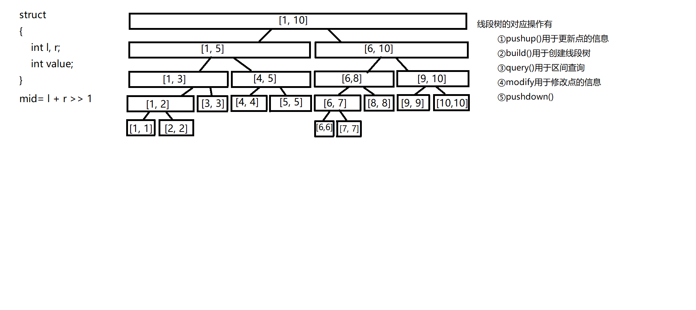

数据结构

[TOC]


## 链表

针对于链表实际为线性表的一种，是一种线性结构，而线性表的定义是：零个或多个数据元素的有序序列。一个序列中元素是连续的并且除首尾外其他的数据元素都有唯一的前驱和后继，那么链表也是这样的一种结构，针对于这种线性结构又有何种存储方式呢？不难想到有序序列可以存储至数组中，那么链表的顺序存储（指使用一段连续的内存空间）方式便是数组，那么我们便可以通过数组来模拟链表，但是数组有一个很大的缺陷，这便是一旦数组的维度确定，那么该链表能够存储的元素个数也是唯一的，这种情况可能会造成空间浪费或者是空间消耗过大，那么与之相对的一种存储方式便是链式存储，像一根链子一样将该序列中的数据元素穿插起来，在链表的顺序存储中数组的每一个位置存放着一个数据元素，他的后继显然是下标后一位的元素，而他的前驱便是下标的前一位，由于再内存中连续的存放所以不需要进行连接的操作，但是在链式存储当中，链表的一个节点代表了一个数据元素，那么这个节点应该具有什么属性呢，首先对应需要存储的数据是必不可少的，于此同时我们还需要将每一个节点穿插起来，所以我们需要一个指针用以指向他的后继节点，所以在链表中一个节点有两个部分，一个部分是数据域用于存放数据，另一部分是指针域，用于指向下一个节点。那么每次创建一个新的节点需要进行的操作将需要保存的数据存放至数据域，将指针域的指向下一个节点，但此处仅介绍了单链表，并且没有将所有插入和删除方法做全部阐述。并且有其他的一些特殊的链表结构此处先不做讲解，后续补充，若想了解也可先参考书籍或者博客。下方先提供单双链表的顺序存储，即数组模拟单双链表。

此处给出单链表的链式结构的插入删除的图解（顺序存储可参照，并以类似方式实现）


此处补充一下单链表的链式存储的写法(仅是个人写法)并且此处写法并没有和图解完全一致，搭建链表时根据实际情况进行调整，但是

整体的思想和图解一致.

```c++
#include <iostream>
#include <algorithm>
#include <string>
using namespace std;
class node
{
	friend class Glist;
	private:
		int data;
		node *next;
};
class Glist
{
	public:
		Glist();
		~Glist();
		bool insert();//尾插法
		bool remove(int k);//移除第k个节点
		int search();
		bool changeNode();
		int getlength();
		bool isempty();
		void print();
	private:
		node *List;
		node *end;
		int length;
};
int main()
{
	Glist L;
	string op;
	puts("输入你需要进行的操作");
	while (cin >> op&&op!="End")
	{
		if (op == "Insert")//插入操作
		{
			if (L.insert())
				puts("插入成功");

		}
		else if (op == "Delete")//删除操作
		{
			//此处下标从1开始
			int k;
			puts("请输入需要删除元素的序号");
			cin >> k;
			if (L.remove(k))
				puts("删除成功");
			else
				puts("删除失败，节点不存在");
		}
		else if (op == "Search")//查询操作
		{
			int t = L.search();
			if (t!= -1)
				cout << "节点位于第" << t << "个位置" << endl;
			//下标从1开始
		}
		else if (op == "Length")//查询表中元素个数、表长
		{
			cout<< "表长为 :" << L.getlength() << endl;
		}
		else if (op == "Empty")//判断表是否为空
		{
			if (L.isempty())
				puts("表空");
			else
				puts("表非空");
		}
		else if (op == "Change")//修改节点数据
		{
			if (L.changeNode())
				puts("修改成功");
			else
				puts("修改失败");
		}
		else if(op=="Show")//显示表中所有元素
		{
			L.print();
			puts("");
		}
		puts("输入你需要进行的操作");
	}
	return 0;
}
Glist::Glist()
{
	List = nullptr;
	end = nullptr;
	length = 0;
}
Glist::~Glist()
{
	node *p = List;
	for (int i = 0; i < length; ++i)
	{
		node *tmp = p;
		p = p->next;
		delete tmp;
	}
}
bool Glist::insert()//尾插法
{
	node *cnode = new node;
	cout << "请输入节点存储数据" << endl;
	cin >> cnode->data;
	if (!length)
	{
		List = cnode;
		end = cnode;
		cnode->next = nullptr;
	}
	else
	{
		end->next= cnode;
		cnode->next = nullptr;
		end = cnode;
	}
	++length;
	return true;
}
bool Glist::remove(int k)
{
	if (k > length)
		return false;
	node *p=List;
	for (int i = 0; i < k-2; ++i)
	{
		p = p->next;
	}
	node *tmp = p->next;
	p->next = p->next->next;
	delete tmp;
	--length;
	return true;
}
int Glist::search()
{
	cout << "请输入需要查找节点的属性 !" << endl;
	int x;
	cin >> x;
	node *p = List;
	int  cnt = 0;
	for (p; p != nullptr; p = p->next)
	{
		++cnt;
		if (p->data == x)
			return cnt;
	}
	cout << "表中不存在该节点 !" << endl;
	return -1;
}
bool Glist::changeNode()
{
	cout << "请输入需要修改的节点的序号 !" << endl;
	int num;
	cin >> num;
	if (num > length)
		return false;
	node *p = List;
	cout << "请输入需要修改的数据值 !" << endl;
	int tmp;
	cin >> tmp;
	for (int i = 0; i < num-1; ++i)
	{
		p = p->next;
	}
	p->data = tmp;
	return true;
}
int Glist::getlength()
{
	return length;
}
bool Glist::isempty()
{
	if (!length)
		return true;
	else
		return false;
}
void Glist::print()
{
	node *p = List;
	if (p == nullptr)
		puts("表空");
	for (p; p != nullptr; p = p->next)
		cout << p->data << "  ";
}
```


```c++
//顺序存储
/*
实现一个单链表，链表初始为空，支持三种操作：
向链表头插入一个数；
删除第 k 个插入的数后面的数；
在第 k 个插入的数后插入一个数。
现在要对该链表进行 M 次操作，进行完所有操作后，从头到尾输出整个链表。
注意:题目中第 k 个插入的数并不是指当前链表的第 k 个数。例如操作过程中一共插入了 n 个数，则按照插入的时间顺序，这 n 个数依次为：第 1 个插入的数，第 2 个插入的数，…第 n 个插入的数。
输入格式
第一行包含整数 M，表示操作次数。
接下来 M 行，每行包含一个操作命令，操作命令可能为以下几种：
H x，表示向链表头插入一个数 x。
D k，表示删除第 k 个插入的数后面的数（当 k 为 0 时，表示删除头结点）。
I k x，表示在第 k 个插入的数后面插入一个数 x（此操作中 k 均大于 0）。
输出格式
共一行，将整个链表从头到尾输出。
数据范围
1≤M≤100000
所有操作保证合法。
输入样例：
10
H 9
I 1 1
D 1
D 0
H 6
I 3 6
I 4 5
I 4 5
I 3 4
D 6
输出样例：
6 4 6 5
*/
#include <iostream>
#include <algorithm>
using namespace std;
const int N=1e5+10;
int e[N],ne[N],idx,head;
int m;
void init();
void add_to_head(int x);
void remove(int k);
void add(int k,int x);

int main()
{
    cin>>m;
    init();
    while(m--)
    {
        char op[2];
        cin>>op;
        if(op[0]=='H')
        {
            int x;
            cin>>x;
            add_to_head(x);
        }
        else if(op[0]=='D')
        {
            int k;
            cin>>k;
            if(!k)
            {
                head=ne[head];
            }
            remove(k-1);
        }
        else
        {
            int k,x;
            cin>>k>>x;
            add(k-1,x);
        }
    }
    for(int i=head;i!=-1;i=ne[i])
    {
        cout<<e[i]<<" ";
    }
    return 0;
}

void init()
{
    head=-1;
    idx=0;
}
void add_to_head(int x)
{
    e[idx]=x;
    ne[idx]=head;
    head=idx;
    ++idx;
}

void remove(int k)
{
    ne[k]=ne[ne[k]];
}

void add(int k,int x)
{
    e[idx]=x;
    ne[idx]=ne[k];
    ne[k]=idx;
    ++idx;
}
```

此处对于双向链表（顺序存储）的删除和插入操作做一图解


```c++
/*
实现一个双链表，双链表初始为空，支持 5 种操作：

在最左侧插入一个数；
在最右侧插入一个数；
将第 k 个插入的数删除；
在第 k 个插入的数左侧插入一个数；
在第 k 个插入的数右侧插入一个数
现在要对该链表进行 M 次操作，进行完所有操作后，从左到右输出整个链表。
注意:题目中第 k 个插入的数并不是指当前链表的第 k 个数。例如操作过程中一共插入了 n 个数，则按照插入的时间顺序，这 n 个数依次为：第 1 个插入的数，第 2 个插入的数，…第 n 个插入的数。
输入格式
第一行包含整数 M，表示操作次数。
接下来 M 行，每行包含一个操作命令，操作命令可能为以下几种：
L x，表示在链表的最左端插入数 x。
R x，表示在链表的最右端插入数 x。
D k，表示将第 k 个插入的数删除。
IL k x，表示在第 k 个插入的数左侧插入一个数。
IR k x，表示在第 k 个插入的数右侧插入一个数。
输出格式
共一行，将整个链表从左到右输出。
数据范围
1≤M≤100000
所有操作保证合法。
输入样例：
10
R 7
D 1
L 3
IL 2 10
D 3
IL 2 7
L 8
R 9
IL 4 7
IR 2 2
输出样例：
8 7 7 3 2 9
*/
#include <iostream>
#include <algorithm>
#include <cstring>
using namespace std;
const int N=1e5+10;
int e[N],l[N],r[N],idx;
int m;
void init();
void add(int k,int x);
void remove(int k);

int main()
{
    init();
    cin>>m;
    while(m--)
    {
        char op[5];
        cin>>op;
        if(op[0]=='L')
        {
            int x;
            cin>>x;
            add(0,x);
        }
        else if (op[0]=='R')
        {
            int x;
            cin>>x;
            add(l[1],x);
        }
        else if(op[0]=='D')
        {
            int k;
            cin>>k;
            remove(k+1);
        }
        else if(!strcmp(op,"IL"))
        {
            int k,x;
            cin>>k>>x;
            add(l[k+1],x);
        }
        else
        {
            int k,x;
            cin>>k>>x;
            add(k+1,x);
        }
    }
    for(int i=r[0];i!=1;i=r[i])
    {
        cout<<e[i]<<" ";
    }
    return 0;
}

void init()
{
    r[0]=1;
    l[1]=0;
    idx=2;
}
void add(int k,int x)
{
    e[idx]=x;
    r[idx]=r[k];
    l[idx]=k;
    l[r[k]]=idx;
    r[k]=idx;
    ++idx;
}
void remove(int k)
{
    r[l[k]]=r[k];
    l[r[k]]=l[k];
}
```


## 栈和队列、单调栈、单调队列

栈和队列也是一种线性结构而单调栈和单调队列仅仅是这两种数据结构特殊的情况而已

### 栈

此处仅介绍模拟栈的方法（实际使用时当题目给予时间充足可直接使用STL中的stack）

栈的主要特性先进后出

```c++
/*
实现一个栈，栈初始为空，支持四种操作：
push x – 向栈顶插入一个数 x；
pop – 从栈顶弹出一个数；
empty – 判断栈是否为空；
query – 查询栈顶元素。
现在要对栈进行 M 个操作，其中的每个操作 3 和操作 4 都要输出相应的结果。
输入格式
第一行包含整数 M，表示操作次数。
接下来 M 行，每行包含一个操作命令，操作命令为 push x，pop，empty，query 中的一种。
输出格式
对于每个 empty 和 query 操作都要输出一个查询结果，每个结果占一行。
其中，empty 操作的查询结果为 YES 或 NO，query 操作的查询结果为一个整数，表示栈顶元素的值。
数据范围
1≤M≤100000,
1≤x≤109
所有操作保证合法。
输入样例：
10
push 5
query
push 6
pop
query
pop
empty
push 4
query
empty
输出样例：
5
5
YES
4
NO
*/
#include <iostream>
#include <algorithm>
#include <string>
using namespace std;
const int N=1e5+10;
int stk[N],tt;
int m;
void push(int x);
void pop();
bool empty();
int query();

int main()
{
    cin>>m;
    while(m--)
    {
        string op;
        cin>>op;
        if(op=="push")
        {
            int x;
            cin>>x;
            push(x);
        }
        else if(op=="pop")
        {
            pop();
        }
        else if(op=="empty")
        {
            if(empty())
                puts("YES");
            else
                puts("NO");
        }
        else
        {
            cout<<query()<<endl;
        }
    }
    return 0;
}
void push(int x)
{
    stk[++tt]=x;
}
void pop()
{
    --tt;
}
bool empty()
{
    return tt?false:true;
}
int query()
{
    if(tt)
        return stk[tt];
    else
    {
        cout<<"栈空"<<endl;
    }
}
```

### 表达式求值

```c++
/*
给定一个表达式，其中运算符仅包含 +,-,*,/（加 减 乘 整除），可能包含括号，请你求出表达式的最终值。
注意：
数据保证给定的表达式合法。
题目保证符号 - 只作为减号出现，不会作为负号出现，例如，-1+2,(2+2)*(-(1+1)+2) 之类表达式均不会出现。
题目保证表达式中所有数字均为正整数。
题目保证表达式在中间计算过程以及结果中，均不超过 2^31−1。
题目中的整除是指向 0 取整，也就是说对于大于 0 的结果向下取整，例如 5/3=1，对于小于 0 的结果向上取整，例如 5/(1−4)=−1。
C++和Java中的整除默认是向零取整；Python中的整除//默认向下取整，因此Python的eval()函数中的整除也是向下取整，在本题中不能直接使用。
输入格式
共一行，为给定表达式。
输出格式
共一行，为表达式的结果。
数据范围
表达式的长度不超过 105。
输入样例：
(2+2)*(1+1)
输出样例：
8
*/
#include <iostream>
#include <algorithm>
#include <stack>
#include <unordered_map>
#include <cstring>
#include <string>
using namespace std;
stack <int> num;
stack <char> op;
unordered_map<char,int> pt={{'+',1}, {'-',1}, {'*',2}, {'/',2}};
void eval();

int main()
{
    string str;
    cin>>str;
    for(int i=0;i<str.size();++i)
    {
        auto c = str[i];
        if(isdigit(c))
        {
            int x=0,j=i;
            while(j<str.size()&&isdigit(str[j]))
                x=x*10+(str[j++]-'0');
            i=j-1;
            num.push(x);
        }
        else if(c == '(')
            op.push(c);
        else if(c == ')')
        {
            while(op.top() != '(')
                eval();
            op.pop();
        }
        else
        {
            while(op.size() && op.top() != '(' && pt[op.top()] >= pt[c])
            {
                eval();
            }
            op.push(c);
        }
    }
    while(op.size())
        eval();
    cout<<num.top()<<endl;
    return 0;
}

void eval()
{
    int x=0;
    auto b=num.top();
    num.pop();
    auto a=num.top();
    num.pop();
    auto c=op.top();
    op.pop();
    if(c == '+')
        x=a+b;
    else if(c == '-')
        x=a-b;
    else if(c == '*')
        x=a*b;
    else
        x=a/b;
    num.push(x);
}
```


### 表达式转换(链式栈)

```c++
/*
计算方法
前缀表达式的计算机求值：
从右至左扫描表达式，遇到数字时，将数字压入堆栈，遇到运算符时，弹出栈顶的两个数，用运算符对它们做相应的计算（栈顶元素 op 次顶元素），并将结果入栈；重复上述过程直到表达式最左端，最后运算得出的值即为表达式的结果。
例如前缀表达式“- × + 3 4 5 6”：
(1) 从右至左扫描，将6、5、4、3压入堆栈；
(2) 遇到+运算符，因此弹出3和4（3为栈顶元素，4为次顶元素，注意与后缀表达式做比较），计算出3+4的值，得7，再将7入栈；
(3) 接下来是×运算符，因此弹出7和5，计算出7×5=35，将35入栈；
(4) 最后是-运算符，计算出35-6的值，即29，由此得出最终结果。


后缀表达式的计算机求值：
与前缀表达式类似，只是顺序是从左至右：
从左至右扫描表达式，遇到数字时，将数字压入堆栈，遇到运算符时，弹出栈顶的两个数，用运算符对它们做相应的计算（次顶元素 op 栈顶元素），并将结果入栈；重复上述过程直到表达式最右端，最后运算得出的值即为表达式的结果。
例如后缀表达式“3 4 + 5 × 6 -”：
(1) 从左至右扫描，将3和4压入堆栈；
(2) 遇到+运算符，因此弹出4和3（4为栈顶元素，3为次顶元素，注意与前缀表达式做比较），计算出3+4的值，得7，再将7入栈；
(3) 将5入栈；
(4) 接下来是×运算符，因此弹出5和7，计算出7×5=35，将35入栈；
(5) 将6入栈；
(6) 最后是-运算符，计算出35-6的值，即29，由此得出最终结果。


转换方法
将中缀表达式转换为前缀表达式：
遵循以下步骤：
(1) 初始化两个栈：运算符栈S1和储存中间结果的栈S2；
(2) 从右至左扫描中缀表达式；
(3) 遇到操作数时，将其压入S2；
(4) 遇到运算符时，比较其与S1栈顶运算符的优先级：
(4-1) 如果S1为空，或栈顶运算符为右括号“)”，则直接将此运算符入栈；
(4-2) 否则，若优先级比栈顶运算符的较高或相等，也将运算符压入S1；
(4-3) 否则，将S1栈顶的运算符弹出并压入到S2中，再次转到(4-1)与S1中新的栈顶运算符相比较；
(5) 遇到括号时：
(5-1) 如果是右括号“)”，则直接压入S1；
(5-2) 如果是左括号“(”，则依次弹出S1栈顶的运算符，并压入S2，直到遇到右括号为止，此时将这一对括号丢弃；
(6) 重复步骤(2)至(5)，直到表达式的最左边；
(7) 将S1中剩余的运算符依次弹出并压入S2；
(8) 依次弹出S2中的元素并输出，结果即为中缀表达式对应的前缀表达式。


将中缀表达式转换为后缀表达式：
与转换为前缀表达式相似，遵循以下步骤：
(1) 初始化两个栈：运算符栈S1和储存中间结果的栈S2；
(2) 从左至右扫描中缀表达式；
(3) 遇到操作数时，将其压入S2；
(4) 遇到运算符时，比较其与S1栈顶运算符的优先级：
(4-1) 如果S1为空，或栈顶运算符为左括号“(”，则直接将此运算符入栈；
(4-2) 否则，若优先级比栈顶运算符的高，也将运算符压入S1（注意转换为前缀表达式时是优先级较高或相同，而这里则不包括相同的情况）；
(4-3) 否则，将S1栈顶的运算符弹出并压入到S2中，再次转到(4-1)与S1中新的栈顶运算符相比较；
(5) 遇到括号时：
(5-1) 如果是左括号“(”，则直接压入S1；
(5-2) 如果是右括号“)”，则依次弹出S1栈顶的运算符，并压入S2，直到遇到左括号为止，此时将这一对括号丢弃；
(6) 重复步骤(2)至(5)，直到表达式的最右边；
(7) 将S1中剩余的运算符依次弹出并压入S2；
(8) 依次弹出S2中的元素并输出，结果的逆序即为中缀表达式对应的后缀表达式（转换为前缀表达式时不用逆序）。

*/

#include <iostream>
#include <unordered_map>
using namespace std;
const int N = 1010;
unordered_map<char, int> pt = { {'+',1},{'-',1},{'*',2},{'/',2}};
template <class T>
class node
{
	template <class T> friend class Stack;
public:
	node(T e);
private:
	T data;
	node<T>* next;
};
template <class T>
class Stack
{
public:
	Stack();
	void Push(node<T>*& t);
	T Top();
	bool pop();
	bool Empty();
private:
	node<T>* ListStack;
};
int Length(char* ch);

int main()
{
	Stack<char> op,num;
	char exp[N];
	cin >> exp;
	int len = Length(exp);
	//中缀转前缀
	for (int i = len - 1; i >= 0; --i)
	{
		if (exp[i] >= '0' && exp[i] <= '9')
		{
			node<char>* p = new node<char>(exp[i]);
			num.Push(p);
		}
		else if (exp[i] == ')')
		{
			node<char>* p = new node<char>(exp[i]);
			op.Push(p);
		}
		else if (exp[i] == '(')
		{
			while (op.Top() != ')')
			{
				node<char>* p = new node<char>(op.Top());
				num.Push(p);
				op.pop();
			}
			op.pop();
		}
		else
		{
			while (!op.Empty() && op.Top() > exp[i])
			{
				node<char>* p = new node<char>(op.Top());
				num.Push(p);
				op.pop();
			}
			node<char>* temp = new node<char>(exp[i]);
			op.Push(temp);
		}
	}
	while (!op.Empty())
	{
		node<char>* p = new node<char>(op.Top());
		num.Push(p);
		op.pop();
	}
	while (!num.Empty())
	{
		cout << num.Top();
		num.pop();
	}
	//中缀转后缀
	/*
	Stack<char> op,num;
	char exp[N];
	cin >> exp;
	int len = Length(exp);
	for (int i = 0; i < len; ++i)
	{
		if (exp[i] == '(')
		{
			node<char>* p = new node<char>(exp[i]);
			op.Push(p);
		}
		else if (exp[i] == ')')
		{
			while (op.Top() != '(')
			{
				node<char>* p = new node<char>(op.Top());
				num.Push(p);
				op.pop();
			}
			op.pop();
		}
		else if (exp[i] >= '0' && exp[i] <= '9')
		{
			node<char>* p = new node<char>(exp[i]);
			num.Push(p);
		}
		else
		{
			while (!op.Empty() && pt[exp[i]] <= pt[op.Top()])
			{
				node<char>* p = new node<char>(op.Top());
				num.Push(p);
				op.pop();
			}
			node<char>* temp = new node<char>(exp[i]);
			op.Push(temp);
		}
	}
	while (!op.Empty())
	{
		node<char>* p = new node<char>(op.Top());
		num.Push(p);
		op.pop();
	}
	char res[N];
	int idx = 0;
	while (!num.Empty())
	{
		char s = num.Top();
		res[idx++] = s;
		num.pop();
	}
	for (idx=idx-1; idx >= 0; --idx)
	{
		cout << res[idx];
	}
	*/
	return 0;
}

template <class T>
node<T>::node(T e)
{
	data = e;
	next = nullptr;
}

template <class T>
Stack<T>::Stack()
{
	ListStack = nullptr;
}

template <class T>
void Stack<T>::Push(node<T>*& t)
{
	if (ListStack == nullptr)
	{
		ListStack = t;
		t->next = nullptr;
	}
	else
	{
		t->next = ListStack;
		ListStack = t;
	}
}

template <class T>
T Stack<T>::Top()
{
	if (ListStack != nullptr)
		return ListStack->data;
}

template <class T>
bool Stack<T>::pop()
{
	if (ListStack != nullptr)
	{
		node<T>* temp = ListStack;
		ListStack = temp->next;
		delete temp;
		return true;
	}
	else
		return false;
}

template <class T>
bool Stack<T>::Empty()
{
	if (ListStack != nullptr)
		return false;
	else
		return true;
}

int Length(char* ch)
{
	int len = 0;
	while (*ch != '\0')
	{
		++len;
		++ch;
	}
	return len;
}
```


### 单调栈

此处给出一个单调栈较为常用的应用场景
$$
\begin{align}
&给定一个长度为 N 的整数数列，输出每个数左边第一个比它小的数，如果不存在则输出 −1。\\
&输入格式\\
&第一行包含整数 N，表示数列长度。\\
&第二行包含 N 个整数，表示整数数列。\\
&输出格式\\
&共一行，包含 N 个整数，其中第 i 个数表示第 i 个数的左边第一个比它小的数，如果不存在则输出 −1。\\
&数据范围\\
&1≤N≤105\\
&1≤数列中元素≤109\\
&输入样例：\\
&5\\
&3 4 2 7 5\\
&输出样例：\\
&-1\quad  3\quad -1\quad 2\quad 2\\
\end{align}
$$
首先暴力解法应该很容易能想到那就是从左到右遍历数列，每遍历至一个数内循环从该数的位置往左遍历直至找到第一个比该数小的元素或者遍历至数列头(此时左边不存在比该点小的点)那么可以预估一下这个复杂度平均为O(n^2)，那么我们可以观察一下暴力做法有什么可以优化的地方，我们发现每一次遍历至一个元素的时候需要去他的左边寻找比他小的数字，那么假设左边存在数字a大于该元素b，那么我们可以发现这个元素a其实是没有用处的，因为该元素b后面的元素在寻找比其小的元素的时候，由于a在b的左边并且a>b那么b后面的元素必定先找到元素b并输出那么此时可以发现元素a是没有用的，那么根据这一特点我们可以用一个栈来维护这个数列集合，并且维护的过程中该栈中的元素始终是非单调递减的.对于遍历数列，每次将一个数字放入栈的时候需要判断栈中的元素是否是满足<该数字，若满足则压入栈中.

```c++
#include <iostream>
#include <algorithm>
using namespace std;
const int N=1e5+10;
int stk[N],tt,n;

int main()
{
    cin>>n;
    while(n--)
    {
        int x;
        cin>>x;
        while(tt&&stk[tt]>=x)
            --tt;
        if(tt)
            cout<<stk[tt]<<' ';
        else
            cout<<-1<<' ';
        stk[++tt]=x;
    }
    return 0;
}
```

此处提供栈的链式存储(模板)写法用于判断回文串

```c++
#include <iostream>
#include <cstring>
#include <stdio.h>
using namespace std;
const int N = 1010;

template <class T>
class node
{
	template <class T> friend class Stack;
	public:
		node(T e);
	private:
		T data;
		node<T> *next;
};
template <class T>
class Stack
{
	public:
		Stack();
		void Push(node<T> *&t);
		T Top();
		bool pop();
		bool Empty();
	private:
		node<T> *ListStack;
};
int Length(char* ch);

int main()
{
	char str[N];
	gets_s(str);
	Stack<char> s;
	int len = Length(str);
	for (int i = 0; i < len; ++i)
	{
		if (str[i] != '\0')
		{
			node<char>* p = new node<char>(str[i]);
			s.Push(p);
		}
	}
	bool flag = true;
	for (int i = 0; i < len; ++i)
	{
		if (str[i] != s.Top())
		{
			flag = false;
			break;
		}
		s.pop();
	}
	if (flag)
		cout << "是回文串" << endl;
	else
		cout << "不是回文串" << endl;
	return 0;
}

template <class T>
node<T>::node(T e)
{
	data = e;
}

template <class T>
Stack<T>::Stack()
{
	ListStack = nullptr;
}

template <class T>
void Stack<T>::Push(node<T>*& t)
{
	if (ListStack == nullptr)
	{
		ListStack = t;
		t->next = nullptr;
	}
	else
	{
		t->next = ListStack;
		ListStack = t;
	}
}

template <class T>
T Stack<T>::Top()
{
	if (ListStack != nullptr)
		return ListStack->data;
}

template <class T>
bool Stack<T>::pop()
{
	if (ListStack != nullptr)
	{
		node<T>* temp = ListStack;
		ListStack = temp->next;
		delete temp;
		return true;
	}
	else
		return false;
}

template <class T>
bool Stack<T>::Empty()
{
	if (ListStack != nullptr)
		return false;
	else
		return true;
}

int Length(char* ch)
{
	int len = 0;
	while (*ch!='\0')
	{
		++len;
		++ch;
	}
	return len;
}
```


### 队列

此处仅介绍模拟队列的方法(实际使用时当题目给予时间充足可直接使用STL中的queue)

队列的主要特性先进先出

```c++
/*
实现一个队列，队列初始为空，支持四种操作：
push x – 向队尾插入一个数 x；
pop – 从队头弹出一个数；
empty – 判断队列是否为空；
query – 查询队头元素。
现在要对队列进行 M 个操作，其中的每个操作 3 和操作 4 都要输出相应的结果。
输入格式
第一行包含整数 M，表示操作次数。
接下来 M 行，每行包含一个操作命令，操作命令为 push x，pop，empty，query 中的一种。
输出格式
对于每个 empty 和 query 操作都要输出一个查询结果，每个结果占一行。
其中，empty 操作的查询结果为 YES 或 NO，query 操作的查询结果为一个整数，表示队头元素的值。
数据范围
1≤M≤100000,
1≤x≤109,
所有操作保证合法。
输入样例：
10
push 6
empty
query
pop
empty
push 3
push 4
pop
query
push 6
输出样例：
NO
6
YES
4
*/
#include <iostream>
#include <algorithm>
#include <string>
using namespace std;
const int N=1e5+10;
int q[N],hh,tt=-1;
int m;
void push(int x);
void pop();
bool empty();
int query();

int main()
{
    cin>>m;
    while(m--)
    {
        string op;
        cin>>op;
        if(op=="push")
        {
            int x;
            cin>>x;
            push(x);
        }
        else if(op=="pop")
        {
            pop();
        }
        else if(op=="empty")
        {
            if(empty())
                puts("YES");
            else
                puts("NO");
        }
        else
        {
            cout<<query()<<endl;
        }
    }
    return 0;
}

void push(int x)
{
    q[++tt]=x;
}
void pop()
{
    ++hh;
}
bool empty()
{
    if(hh<=tt)
        return false;
    
    return true;
}
int query()
{
    if(hh<=tt)
        return q[hh];
}
```

### 链式队列

```c++
链式队列
#include <iostream>
using namespace std;

template <class T>
class node
{
	public:
		node<T>(T e);
		template <class T> friend class Queue;
	private:
		T data;
		node<T> *next;
};

template <class T>
class Queue
{
	public:
		Queue<T>();
		void Push(node<T> *& t);
		bool Pop();
		bool Empty();
		T Front();
	private:
		node<T> *ListQueue;
};
void show();

int main()
{
	Queue<int> que;
	int section;
	while(1)
	{
		show();
		cin >> section;
		if (section == 1)
		{
			cout << "请输入需要存储的值" << endl;
			int value;
			cin >> value;
			node<int>* t = new node<int>(value);
			que.Push(t);
		}
		else if (section == 2)
		{
			if (que.Pop())
				cout << "出队成功" << endl;
			else
				cout << "出队失败" << endl;
		}
		else if (section == 3)
		{
			if (que.Empty())
				cout << "队列为空" << endl;
			else
				cout << "队列非空" << endl;
		}
		else if (section == 4)
		{
			cout << "队首元素为：";
			cout << que.Front() << endl;
		}
		else if(section==5)
			exit(0);
	}
	return 0;
}

template <class T>
node<T>::node<T>(T e)
{
	data = e;
	next = nullptr;
}

template <class T>
Queue<T>::Queue<T>()
{
	ListQueue = nullptr;
}

template <class T>
void Queue<T>::Push(node<T>*& t)
{
	if (ListQueue == nullptr)
	{
		ListQueue = t;
		t->next = nullptr;
	}
	else
	{
		node<T> *p = ListQueue;
		while (p->next != nullptr)
		{
			p = p->next;
		}
		p->next = t;
		t->next = nullptr;
	}
}

template <class T>
bool Queue<T>::Pop()
{
	if (ListQueue != nullptr)
	{
		node<T> *temp = ListQueue;
		ListQueue = temp->next;
		delete temp;
	}
	else
		return false;
}

template <class T>
bool Queue<T>::Empty()
{
	if (ListQueue == nullptr)
		return true;
	else
		return false;
}
template <class T>
T Queue<T>::Front()
{
	if (ListQueue != nullptr)
		return ListQueue->data;
}

void show()
{
	cout << "请输入你需要进行的操作" << endl;
	cout << "1.插入元素" << endl;
	cout << "2.删除元素" << endl;
	cout << "3.队列是否为空" << endl;
	cout << "4.获取队首元素" << endl;
	cout << "5.退出" << endl;
}

```

### 循环队列(链式)

```c++
#include <iostream>
using namespace std;

template <class T>
class node
{
	public:
		node<T>(T e);
		template <class T> friend class Queue;
	private:
		T data;
		node<T> *next;
};

template <class T>
class Queue
{
	public:
		Queue<T>();
		void Push(node<T> *& t);
		bool Pop();
		bool Empty();
		T Front();
	private:
		node<T> *ListQueue;
		node<T> *tail;
};
void show();

int main()
{
	Queue<int> que;
	int section;
	while(1)
	{
		show();
		cin >> section;
		if (section == 1)
		{
			cout << "请输入需要存储的值" << endl;
			int value;
			cin >> value;
			node<int>* t = new node<int>(value);
			que.Push(t);
		}
		else if (section == 2)
		{
			if (que.Pop())
				cout << "出队成功" << endl;
			else
				cout << "出队失败" << endl;
		}
		else if (section == 3)
		{
			if (que.Empty())
				cout << "队列为空" << endl;
			else
				cout << "队列非空" << endl;
		}
		else if (section == 4)
		{
			if (que.Front() != 0x3f3f3f3f)
			{
				cout << "队首元素为：";
				cout << que.Front() << endl;
			}
			else
				cout << "队列中无元素" << endl;
		}
		else if (section == 5)
			exit(0);
	}
	return 0;
}

template <class T>
node<T>::node<T>(T e)
{
	data = e;
	next = nullptr;
}

template <class T>
Queue<T>::Queue<T>()
{
	ListQueue = tail = nullptr;
}

template <class T>
void Queue<T>::Push(node<T>*& t)
{
	if (ListQueue == nullptr && tail == nullptr)
	{
		ListQueue = tail = t;
		t->next = t;
	}
	else if(ListQueue != nullptr && tail != nullptr)
	{
		tail->next = t;
		t->next = ListQueue;
		tail = t;
	}
}

template <class T>
bool Queue<T>::Pop()
{
	if (ListQueue != nullptr && tail != nullptr && ListQueue != tail)
	{
		node<T> *temp = ListQueue;
		ListQueue = temp->next;
		tail->next = ListQueue;
		delete temp;
		return true;
	}
	else if (ListQueue != nullptr && tail != nullptr && ListQueue == tail)
	{
		node<T>* temp = ListQueue;
		ListQueue = tail = nullptr;
		delete temp;
		return true;
	}
	else if(ListQueue == nullptr && tail == nullptr)
		return false;
}

template <class T>
bool Queue<T>::Empty()
{
	if (ListQueue == nullptr && tail == nullptr)
		return true;
	else
		return false;
}
template <class T>
T Queue<T>::Front()
{
	if (ListQueue != nullptr)
		return ListQueue->data;
	else
		return 0x3f3f3f3f;
}

void show()
{
	cout << "请输入你需要进行的操作" << endl;
	cout << "1.插入元素" << endl;
	cout << "2.删除元素" << endl;
	cout << "3.队列是否为空" << endl;
	cout << "4.获取队首元素" << endl;
	cout << "5.退出" << endl;
}
```


### 单调队列

```
题目：
给定一个大小为 n≤1e6 的数组。
有一个大小为 k 的滑动窗口，它从数组的最左边移动到最右边。
你只能在窗口中看到 k 个数字。
每次滑动窗口向右移动一个位置。
以下是一个例子：
该数组为 [1 3 -1 -3 5 3 6 7]，k 为 3。
窗口位置	            最小值	最大值
[1 3 -1] -3 5 3 6 7	    -1	 3
1 [3 -1 -3] 5 3 6 7	    -3	 3
1 3 [-1 -3 5] 3 6 7	    -3	 5
1 3 -1 [-3 5 3] 6 7	    -3	 5
1 3 -1 -3 [5 3 6] 7	     3	 6
1 3 -1 -3 5 [3 6 7]	     3	 7
你的任务是确定滑动窗口位于每个位置时，窗口中的最大值和最小值。
输入格式
输入包含两行。
第一行包含两个整数 n 和 k，分别代表数组长度和滑动窗口的长度。
第二行有 n 个整数，代表数组的具体数值。
同行数据之间用空格隔开。
输出格式
输出包含两个。
第一行输出，从左至右，每个位置滑动窗口中的最小值。
第二行输出，从左至右，每个位置滑动窗口中的最大值。
输入样例：
8 3
1 3 -1 -3 5 3 6 7
输出样例：
-1 -3 -3 -3 3 3
3 3 5 5 6 7
```

与单调栈相类似我们先考虑暴力做法，暴力做法的复杂度平均是O(nk)， 对于暴力解法我们利用队列保证滑动过程中队列中元素个数始终为k，每滑动一次遍历整个队列去寻找最大值和最小值，那么这种解法当数据范围过大的时候是肯定会超时的，那么我们可以利用单调队列将时间复杂度优化到O(n)，那么就可以解决超时的问题，那么单调队列是如何应用的呢？首先此处的队列必须要手动模拟由于单调队列的应用中会出现STL中的queue不能实现的功能，我们以找一个窗口中最小值为例，我们遍历至一个窗口，当往后移动时我们需要加入新元素，那么假设我们的新元素比现队列中的元素都要小，那么现队列中的元素肯定都是没有用的，那么我们就可以将其出队，注意此处的出队从队尾出(而一般情况下的队列出队是从队首出队入队是从队尾入队)，那么我们想得到一个窗口中的最小值只需要输出该窗口的即队列的队首即可，与之相似寻找最大值也是如此.

```c++
#include <iostream>
#include <cstdio>
using namespace std;
const int N=1e6+10;
int n,k;
int a[N],q[N];

int main()
{
    scanf("%d%d",&n,&k);
    for(int i=0;i<n;++i)
    {
        scanf("%d",&a[i]);
    }
    int hh=0,tt=-1;
    for(int i=0;i<n;++i)
    {
        if(hh<=tt&&i-k+1>q[hh])
        {
            ++hh;
        }
        while(hh<=tt&&a[q[tt]]>a[i])
        {
            --tt;
        }
        q[++tt]=i;
        if(i>=k-1)
        {
            printf("%d ",a[q[hh]]);
        }
    }
    puts("");
    hh=0,tt=-1;
    for(int i=0;i<n;++i)
    {
        if(hh<=tt&&i-k+1>q[hh])
        {
            ++hh;
        }
        while(hh<=tt&&a[q[tt]]<a[i])
        {
            --tt;
        }
        q[++tt]=i;
        if(i>=k-1)
        {
            printf("%d ",a[q[hh]]);
        }
    }
    return 0;
}
```

### 跳房子(单调队列优化)

这里给出一个用单调队列加上二分的例子

我们花费g金币去改造机器人之后可以得到机器人向右弹跳距离范围的一个区间为[max(1,d-g),d+g];我们还可以发现花费金币数和分数增长之间的关系，存在单调性，那么单调一定可以二分，我们只需要判断二分需要满足的性质是什么，而这里需要满足的性质就是分数>=k.所以我们可以对花费金币数进行二分找到满足分数>=k这一性质的边界.而这个边界花费金币数就是我们的答案，最少花费金币数量.那么现在的重点就是如何去判断是否满足这个性质，并且二分时候左右端点是什么，由于我们点的个数是500000个，要求分数的范围是[1,1e9]，机器人初始时是2000的弹跳距离，那么再结合我们花费金币后机器人弹跳范围，我们想要金币花费最少，假设每个点都得走过，分数和才能达到最值，那么我们计算下来需要花费的平均金币数为2000，但实际上由于每个点的分数分布不均匀，并且并不需要每一个点都经过，所以我们二分可以将左边界设为0，右边界设为2010；之后我们再去解决如何判断是否满足性质这一问题，暴力枚举是必然会超时的，那么我们去考虑DP，参考图中闫式DP分析法.


```c++
/*
跳房子，也叫跳飞机，是一种世界性的儿童游戏，也是中国民间传统的体育游戏之一。
跳房子的游戏规则如下： 
在地面上确定一个起点，然后在起点右侧画 n 个格子，这些格子都在同一条直线上。
每个格子内有一个数字（整数），表示到达这个格子能得到的分数。
玩家第一次从起点开始向右跳，跳到起点右侧的一个格子内。
第二次再从当前位置继续向右跳，依此类推。
规则规定：玩家每次都必须跳到当前位置右侧的一个格子内。
玩家可以在任意时刻结束游戏，获得的分数为曾经到达过的格子中的数字之和。 
现在小 R 研发了一款弹跳机器人来参加这个游戏。
但是这个机器人有一个非常严重的缺陷，它每次向右弹跳的距离只能为固定的 d。
小 R 希望改进他的机器人，如果他花 g 个金币改进他的机器人，那么他的机器人灵活性就能增加 g，但是需要注意的是，每次弹跳的距离至少为 1。
具体而言，当 g<d 时，他的机器人每次可以选择向右弹跳的距离为 d−g, d−g+1, d−g+2，…，d+g−2，d+g−1，d+g；否则（当 g≥d 时），他的机器人每次可以选择向右弹跳的距离为 1，2，3，…，d+g−2，d+g−1，d+g。 
现在小 R 希望获得至少 k 分，请问他至少要花多少金币来改造他的机器人。
输入格式
第一行三个正整数 n，d，k，分别表示格子的数目，改进前机器人弹跳的固定距离，以及希望至少获得的分数，相邻两个数之间用一个空格隔开。
接下来 n 行，每行两个正整数 xi,si，分别表示起点到第 i 个格子的距离以及第 i 个格子的分数。
两个数之间用一个空格隔开，保证 xi 按递增顺序输入。
输出格式
共一行，一个整数，表示至少要花多少金币来改造他的机器人。
若无论如何他都无法获得至少 k 分，输出 −1。
数据范围
1≤n≤500000,
1≤d≤2000,
1≤xi,k≤109,
|si|≤105
输入样例：
7 4 10
2 6
5 -3
10 3
11 -3
13 1
17 6
20 2
输出样例：
2
*/
#include <iostream>
#include <algorithm>
#include <cstring>
#include <queue>
using namespace std;
typedef long long LL;
const int N=500030;
LL x[N],s[N];
LL k,n,d;
LL f[N];
bool check(int g);

int main()
{
    scanf("%lld%lld%lld",&n,&d,&k);
    for(int i=1;i<=n;++i)
        scanf("%lld%lld",&x[i],&s[i]);
    int L=0,R=2000,ans=-1;
    while(L<R)
    {
        int mid=L+R>>1;
        if(check(mid))
        {
            ans=mid;
            R=mid;
        }
        else
            L=mid+1;
    }
    cout<<ans<<endl;
    
    return 0;
}

bool check(int g)
{
    LL l=max(1LL,d-g),r=d+g;
    memset(f,-0x3f,sizeof f);
    deque<int> q;
    f[0]=0;
    int j=0;
    for(int i=1;i<=n;++i)
    {
        while(x[j]+l<=x[i])//有可能在右移过程中能跳到第i个格子
        {
            while(!(q.empty())&&f[q.back()]<f[j])//新加入的和队列尾比较若是小于则删除
                q.pop_back();
            q.push_back(j);
            ++j;
        }
        while(!(q.empty())&& x[q.front()]+r <x[i])//把到不了的删去
            q.pop_front();
        if(!(q.empty()))
            f[i]=f[q.front()]+s[i];
        else
            f[i]=-1e18;
        if(f[i]>=k)
            return true;
    }
    return false;
}
/*
#include <iostream>
#include <algorithm>
#include <cstring>
using namespace std;
typedef long long LL;
const int N=500030;
LL x[N],s[N];
LL k,n,d;
LL f[N];
LL q[N];
bool check(int g);

int main()
{
    scanf("%lld%lld%lld",&n,&d,&k);
    for(int i=1;i<=n;++i)
        scanf("%lld%lld",&x[i],&s[i]);
    int L=0,R=2010,ans=-1;
    while(L<R)
    {
        int mid=L+R>>1;
        if(check(mid))
        {
            ans=mid;
            R=mid;
        }
        else
            L=mid+1;
    }
    cout<<ans<<endl;

    return 0;
}

bool check(int g)
{
    int hh=0, tt=-1;
    LL l=max(1LL,d-g),r=d+g;
    memset(f,-0x3f,sizeof f);
    f[0]=0;
    int j=0;
    for(int i=1;i<=n;++i)
    {
        while(x[j]+l<=x[i])//有可能在右移过程中能跳到第i个格子
        {
            while((hh<=tt)&&(f[q[tt]]<f[j]))//新加入的和队列尾比较若是小于则删除
                --tt;
            q[++tt]=j;
            ++j;
        }
        while((hh>=0&&tt>=0)&&(hh<=tt)&&(x[q[hh]]+r<x[i]))//把到不了的删去
            ++hh;
        if((hh>=0&&tt>=0)&&hh<=tt)
            f[i]=f[q[hh]]+s[i];
        else
            f[i]=-1e18;
        if(f[i]>=k)
            return true;
    }
    return false;
}

*/
```


## KMP

$$
\begin{align}
&字符串的模式匹配是给定一个目标串以及一个模式串，要求查找模式串是否出现在目标串当中，对于朴素算法会发生回溯\\
&但是这些回溯有的是可以避免的在此不对朴素匹配算法做太多阐述。而KMP算法是字符串模式匹配的利器.那么KMP\\
&算法中最为重要的是next数组，那么next数组是如何得到的呢？\\
&其实next数组是对模式串求最长相等前后缀，即求出模式串的前缀表.\\
&对于朴素的暴力做法的时间复杂度为O(mn).\\
&前缀的定义为:包含首字母不包含尾字母的所有子串都称为前缀.后缀定义为:只包含尾字母不包含首字母的所有子串.\\
&假定目标串为:aabaabaaf \quad \quad 模式串为:aabaaf\\
&我们可以得到模式串的各个子串的最长相等前后缀(前缀表):\\
&子串    \quad \quad  最长相等前后缀  \\
&a      \quad \quad \quad \quad \quad 0           \\
&aa     \quad \quad \quad \quad  \ \ 1  \\
&aab    \quad \quad \quad \quad  0           \\
&aaba   \quad \quad \quad \ \ 1      \\
&aabaa  \quad \quad \quad  2           \\
&aabaaf \quad \quad \ \ 0       \\
&当在进行模式匹配时发现不匹配时不需要像朴素算法一样回退到模式串的头进行从新匹配，而是回退到不相等的字符出\\
&现位置的前缀中出现的最长相等前后缀对应数值的下标位置进行继续匹配.\\
&那么next的求解过程大体有四步:\\
&①.数组初始化.\\
&②.处理前后缀不相同的情况.\\
&③.处理前后缀相同的情况\\
&④.更新next数组的值.\\
&\\
\end{align}
$$

```c++
第一行输入整数 N，表示字符串 P 的长度。
第二行输入字符串 P。
第三行输入整数 M，表示字符串 S 的长度。
第四行输入字符串 S。
输出格式
共一行，输出所有出现位置的起始下标（下标从 0 开始计数），整数之间用空格隔开
数据范围
1≤N≤105
1≤M≤106
输入样例：
3
aba
5
ababa
输出样例：
0 2
*//*
给定一个模式串 S，以及一个模板串 P，所有字符串中只包含大小写英文字母以及阿拉伯数字。
模板串 P 在模式串 S 中多次作为子串出现。
求出模板串 P 在模式串 S 中所有出现的位置的起始下标。
输入格式
第一行输入整数 N，表示字符串 P 的长度。
第二行输入字符串 P。
第三行输入整数 M，表示字符串 S 的长度。
第四行输入字符串 S。
输出格式
共一行，输出所有出现位置的起始下标（下标从 0 开始计数），整数之间用空格隔开
数据范围
1≤N≤105
1≤M≤106
输入样例：
3
aba
5
ababa
输出样例：
0 2
*/
#include <iostream>
using namespace std;
const int N=1e5+10,M=1e6+10;
char p[N],s[M];
int n,m;
int ne[N];

int main()
{
    //目标串和模式串都是从1开始读入
    cin>>n>>p+1;
    cin>>m>>s+1;
    ne[1]=0;//子串仅有一个字符时，最长相等前后缀不存在所以值为0
    for(int i=2,j=0;i<=n;++i)
    //j+1指向前缀未尾位置，i指向后缀末尾位置
    //j表示i之前包含i的子串的最长相等前后缀的长度
    {
        while(j&&p[i]!=p[j+1])
        //处理前后缀不相等，注意两个字符串从1开始存储而j从0开始,j+1表示的
        //是前缀末尾位置，而j记录最长相等前后缀的长度
        {
            j=ne[j];
            //若不想等回退到该不相等字符前一个位置的next数组中的值
            //所表示得到位置，由于j+1代表的是不相等字符的当前位置
            //所以j回退到ne[j]即可.
        }
        if(p[i]==p[j+1])//处理前后缀相等
        {
            ++j;
        }
        ne[i]=j;//给ne数组更新值
    }
    
    for(int i=1,j=0;i<=m;++i)
    {
        while(j&&s[i]!=p[j+1])
        {
            j=ne[j];
        }
        if(s[i]==p[j+1])
        {
            ++j;
        }
        if(j==n)
        {
            cout<<i-n<<" ";
        }
    }
    return 0;
}
```

```c++
/*
KMP 串的模式匹配 (25 point(s))
给定两个由英文字母组成的字符串 String 和 Pattern，要求找到 Pattern 在 String 中第一次出现的位置，并将此位置后的 String 的子串输出。如果找不到，则输出“Not Found”。
本题旨在测试各种不同的匹配算法在各种数据情况下的表现。各组测试数据特点如下：
数据0：小规模字符串，测试基本正确性；
数据1：随机数据，String 长度为 10^5，Pattern 长度为 10；
数据2：随机数据，String 长度为 10^5，Pattern 长度为 10^2；
数据3：随机数据，String 长度为 10^5，Pattern 长度为 10^3；
数据4：随机数据，String 长度为 10^5，Pattern 长度为 10^4；
数据5：String 长度为 10^6，Pattern 长度为 10^5；测试尾字符不匹配的情形；
数据6：String 长度为 10^6，Pattern 长度为 10^5；测试首字符不匹配的情形。
输入格式:
输入第一行给出 String，为由英文字母组成的、长度不超过 10^6的字符串。第二行给出一个正整数 N（≤10），为待匹配的模式串的个数。随后 N 行，每行给出一个 Pattern，为由英文字母组成的、长度不超过 10^5 的字符串。每个字符串都非空，以回车结束。
输出格式:
对每个 Pattern，按照题面要求输出匹配结果。
输入样例:
abcabcabcabcacabxy
3
abcabcacab
cabcabcd
abcabcabcabcacabxyz
结尾无空行
输出样例:
abcabcacabxy
Not Found
Not Found
结尾无空行
*/
#include <iostream>
#include <algorithm>
#include <cstring>
using namespace std;
const int N=1e6+10;
char a[N],b[N];
int ne[N];
 
int main()
{
	int n;
	cin>>a+1;
	int len=strlen(a+1);//目标串长度 
	cin>>n;
	while(n--)
	{
		cin>>b+1;
		int l1=strlen(b+1);//模式串长度 
		ne[1]=0;
		//求ne数组 
		for(int i=2,j=0;i<=l1;++i)
		{
			while(j&&b[i]!=b[j+1])
			{
				j=ne[j];
			}
			if(b[i]==b[j+1])
				++j;
			ne[i]=j;
		}
		
		//去目标串中找模式串是否存在 
		bool flag=false;
		for(int i=1,j=0;i<=len;++i)
		{
			while(j&&a[i]!=b[j+1])
				j=ne[j];
			if(a[i]==b[j+1])
				++j;
			if(j==l1)//判断是否找到模式串 
			{
				flag=true;//用于标记若找到则置为true 
				cout<<a+1+i-l1<<endl;
			}
		}
		if(!flag)
		//当目标串循环结束，模式串仍未寻找完整，那么将退出上方循环且flag值为false 
			puts("Not Found");
		memset(ne,0,sizeof ne);
		memset(b,0,sizeof b);
	}
	return 0;
}
```


## Trie树

$$
\begin{align}
&Trie树是一个用来高效的存储和查找字符串集合的数据结构，一般情况下使用Trie树的字符串全为小写字母或者大写字母或者01\\
&串等，对字符串集合进行遍历，之后将字符串存储到树中，根节点即为0，也为空节点，之后在存储过程中若下一个字符不存在相应\\
&的子节点则建立出来，若存在则继续往下遍历，最后在叶节点位置进行标记，表示以这个字符为结尾的字符串的个数.在查询过程中\\
&若是发现字符串中某一字符不是上一字符的子节点则说明不存在.其中son[N][N]的第一维表示是第几个字符的子节点，当第一维为\\
&0的时候其实就是他的子节点是字符串的首字符，由于根节点只有一个，所以不利于表示多个字符串的第一个字符，所以从0之后的子\\
&节点来表示，第二维表示是对应字符串遍历的字符，如下图.
\end{align}
$$


```c++
/*
维护一个字符串集合，支持两种操作：
I x 向集合中插入一个字符串 x；
Q x 询问一个字符串在集合中出现了多少次。
共有 N 个操作，输入的字符串总长度不超过 105，字符串仅包含小写英文字母。
输入格式
第一行包含整数 N，表示操作数。
接下来 N 行，每行包含一个操作指令，指令为 I x 或 Q x 中的一种。
输出格式
对于每个询问指令 Q x，都要输出一个整数作为结果，表示 x 在集合中出现的次数。
每个结果占一行。
数据范围
1≤N≤2∗104
输入样例：
5
I abc
Q abc
Q ab
I ab
Q ab
输出样例：
1
0
1
*/
#include <iostream>
using namespace std;
const int N=1e5+10;
int  son[N][26],cnt[N];
int idx,n;
char ch[N];
void Insert(char str[]);
int  Query(char str[]);

int main()
{
    cin>>n;
    char op[2];
    while(n--)
    {
        cin>>op;
        if(op[0]=='I')
        {
            cin>>ch;
            Insert(ch);
        }
        else
        {
            cin>>ch;
            cout<<Query(ch)<<endl;
        }
    }
    return 0;
}

void Insert(char str[])
{
    int p=0;
    for(int i=0;str[i];++i)
    {
        int u=str[i]-'a';
        if(!son[p][u])
            son[p][u]=++idx;
        p=son[p][u];
    }
    ++cnt[p];
}

int Query(char str[])
{
    int p=0;
    for(int i=0;str[i];++i)
    {
        int u=str[i]-'a';
        if(!son[p][u])
            return 0;
        p=son[p][u];
    }
    return cnt[p];
}
```

$$
\begin{align}
&针对于最大异或对这道问题\\
&针对于暴力解法，可以将所有两个数的选择枚举出来进行异或再取最大值.但是这种方法很容易超时所以我们可以将数字进行\\
&二进制的表示存储至Trie树中.由于异或每一位不同时才能产生最大值，所以我们可以先将所有数字存储一遍至Trie树中，之\\
&后我们进行查找，每一次寻找寻找二进制表示中每一位不同的进行往下遍历，找到最大.即意为第一遍输入数字的同时将数字以\\
&二进制的形式插入Trie树中，之后对所有数据再进行一次遍历，每遍历一个树将其以二进制形式去Trie树中每一位尽量找与之\\
&不同的节点，直至寻找结束返回最大值，将所有数据遍历完并取其中的最大值便可以得到最后的结果.
&
\end{align}
$$

```c++
/*
在给定的 N 个整数 A1，A2……AN 中选出两个进行 xor（异或）运算，得到的结果最大是多少？
输入格式
第一行输入一个整数 N。
第二行输入 N 个整数 A1～AN。
输出格式
输出一个整数表示答案。
数据范围
1≤N≤105,
0≤Ai<231
输入样例：
3
1 2 3
输出样例：
3
*/
#include <iostream>
#include <algorithm>
using namespace std;
const int N=1e5+10,M=3100010;
int son[M][2],idx,a[N];
int n;
void Insert(int x);
int Query(int x);

int main()
{
    cin>>n;
    for(int i=0;i<n;++i)
    {
        cin>>a[i];
        Insert(a[i]);
    }
    int res=0;
    for(int i=0;i<n;++i)
    {
        res=max(res,Query(a[i]));
    }
    cout<<res<<endl;
    return 0;
}
void Insert(int x)
{
    int p=0;
    for(int i=30;~i;--i)
    {
        int &s=son[p][x>>i&1];
        if(!s) s=++idx;
        p=s;
    }
}

int Query(int x)
{
    int p=0;
    int res=0;
    for(int i=30;~i;--i)
    {
        int s=x>>i&1;
        if(son[p][!s])
        {
            res+=1<<i;
            p=son[p][!s];
        }
        else
            p=son[p][s];
    }
    return res;
}
/*
//朴素做法超时
#include <iostream>
#include <algorithm>
using namespace std;
const int N=1e6+10;
int a[N];
int main()
{
	int n;
	cin>>n;
	for(int i=0;i<n;++i)
	{
		cin>>a[i];
	}
	int res=0;
	for(int i=0;i<n;++i)
	{
		for(int j=0;j<n;++j)
		{
			res=max(res,a[i]^a[j]);
		}
	}
	cout<<res<<endl;
	return 0;
}
*/
```


## 并查集

$$
\begin{align}
&并查集用于维护额外信息，而一般的并查集有以下的操作：合并两个集合、判断两个元素是否属于一个集合，判断图\\
&中连通块数量等，而这些操作都可以通过一个函数实现find(int\quad x)函数实现，并查集本质上是一棵树，而每个节点上\\
&存的是他的父节点是谁，所以当需要判断两个元素所属集合时，我们需要一直寻找到根节点，而这个寻找过程应该是\\
&与树的高度成正比的,所以并没有达到很理想的寻找状态，那么并查集实际上有两种优化可以将过程的复杂度降低，一\\
&种是路径压缩，一种是按秩合并，而这两种通常情况下仅使用路径压缩一种，那么路径压缩是如何实现的呢？，就是在\\
&寻找的过程中，让每个节点的父节点直接设置为根节点，如此在查找过程中可以达到近乎O(1)的复杂度.
\end{align}
$$

```c++
/*
一共有 n 个数，编号是 1∼n，最开始每个数各自在一个集合中。
现在要进行 m 个操作，操作共有两种：
M a b，将编号为 a 和 b 的两个数所在的集合合并，如果两个数已经在同一个集合中，则忽略这个操作；
Q a b，询问编号为 a 和 b 的两个数是否在同一个集合中；
输入格式
第一行输入整数 n 和 m。
接下来 m 行，每行包含一个操作指令，指令为 M a b 或 Q a b 中的一种。
输出格式
对于每个询问指令 Q a b，都要输出一个结果，如果 a 和 b 在同一集合内，则输出 Yes，否则输出 No。
每个结果占一行。
数据范围
1≤n,m≤105
输入样例：
4 5
M 1 2
M 3 4
Q 1 2
Q 1 3
Q 3 4
输出样例：
Yes
No
Yes
*/
#include <iostream>
using namespace std;
const int N=1e5+10;
int p[N],n,m;
int find(int x);

int main()
{
    cin>>n>>m;
    for(int i=1;i<=n;++i)
        p[i]=i;
    int a,b;
    while(m--)
    {
        char op;
        cin>>op>>a>>b;
        if(op=='M')
        {
            p[find(a)]=find(b);
        }
        else
        {
            if(find(a)==find(b))
                puts("Yes");
            else
                puts("No");
        }
    }
    return 0;
}
int find(int x)
{
    if(p[x]!=x) 
        p[x]=find(p[x]);
    return p[x];
}
```

```c++
/*
给定一个包含 n 个点（编号为 1∼n）的无向图，初始时图中没有边。
现在要进行 m 个操作，操作共有三种：
C a b，在点 a 和点 b 之间连一条边，a 和 b 可能相等；
Q1 a b，询问点 a 和点 b 是否在同一个连通块中，a 和 b 可能相等；
Q2 a，询问点 a 所在连通块中点的数量；
输入格式
第一行输入整数 n 和 m。
接下来 m 行，每行包含一个操作指令，指令为 C a b，Q1 a b 或 Q2 a 中的一种。
输出格式
对于每个询问指令 Q1 a b，如果 a 和 b 在同一个连通块中，则输出 Yes，否则输出 No。
对于每个询问指令 Q2 a，输出一个整数表示点 a 所在连通块中点的数量
每个结果占一行。
数据范围
1≤n,m≤105
输入样例：
5 5
C 1 2
Q1 1 2
Q2 1
C 2 5
Q2 5
输出样例：
Yes
2
3
*/
#include <iostream>
using namespace std;
const int N=1e5+10;
int p[N],s[N];
int n,m;
int find(int x);

int main()
{
    cin>>n>>m;
    for(int i=1;i<=n;++i)
    {
        p[i]=i;
        s[i]=1;
    }
    
    while(m--)
    {
        char op[5];
        int a,b;
        cin>>op;
        if(op[0]=='C')
        {
            cin>>a>>b;
            if(find(a)==find(b))
                continue;
            s[find(b)]+=s[find(a)];
            p[find(a)]=find(b);
            //注意必须先修改集合中的数量，若后修改则会在修改集合中的数量是加上的不是
            //另一个集合中的点的数量还是自己本身集合中点的数量
        }
        else if(op[1]=='1')
        {
            cin>>a>>b;
            if(find(a)==find(b))
                puts("Yes");
            else
                puts("No");
        }
        else
        {
            cin>>a;
            cout<<s[find(a)]<<endl;
        }
    }
    return 0;
}

int find(int x)
{
    if(p[x]!=x)
        p[x]=find(p[x]);
    return p[x];
}
```

$$
\begin{align}
&此处针对于并查集的应用\\
&
\end{align}
$$


```c++
/*
动物王国中有三类动物 A,B,C，这三类动物的食物链构成了有趣的环形。
A 吃 B，B 吃 C，C 吃 A。
现有 N 个动物，以 1∼N 编号。
每个动物都是 A,B,C 中的一种，但是我们并不知道它到底是哪一种。
有人用两种说法对这 N 个动物所构成的食物链关系进行描述：
第一种说法是 1 X Y，表示 X 和 Y 是同类。
第二种说法是 2 X Y，表示 X 吃 Y。
此人对 N 个动物，用上述两种说法，一句接一句地说出 K 句话，这 K 句话有的是真的，有的是假的。
当一句话满足下列三条之一时，这句话就是假话，否则就是真话。
当前的话与前面的某些真的话冲突，就是假话；
当前的话中 X 或 Y 比 N 大，就是假话；
当前的话表示 X 吃 X，就是假话。
你的任务是根据给定的 N 和 K 句话，输出假话的总数。
输入格式
第一行是两个整数 N 和 K，以一个空格分隔。
以下 K 行每行是三个正整数 D，X，Y，两数之间用一个空格隔开，其中 D 表示说法的种类。
若 D=1，则表示 X 和 Y 是同类。
若 D=2，则表示 X 吃 Y。
输出格式
只有一个整数，表示假话的数目。
数据范围
1≤N≤50000,
0≤K≤100000
输入样例：
100 7
1 101 1 
2 1 2
2 2 3 
2 3 3 
1 1 3 
2 3 1 
1 5 5
输出样例：
3
*/
#include <iostream>
using namespace std;
const int N=1e5+10;
int p[N],d[N],n,k;
int find(int x);

int main()
{
    cin>>n>>k;
    for(int i=1;i<=n;++i)
    {
        p[i]=i;
    }
    int res=0;
    while(k--)
    {
        int t,x,y;
        cin>>t>>x>>y;
        if(x>n || y>n)
            ++res;
        else
        {
            int px=find(x),py=find(y);
            if(t==1)
            {
                if(px==py&&(d[x]-d[y])%3)
                    ++res;
                else if(px!=py)
                {
                    p[px]=py;
                    d[px]=d[y]-d[x];
                }
            }
            else
            {
                if(px==py&&(d[x]-d[y]-1)%3)
                {
                    ++res;
                }
                else if(px!=py)
                {
                    p[px]=py;
                    d[px]=d[y]+1-d[x];
                }
            }
        }
    }
    cout<<res<<endl;
    return 0;
}

int find(int x)
{
    if(p[x]!=x)
    {
        int t=find(p[x]);
        d[x]+=d[p[x]];
        p[x]=t;
    }
    return p[x];
}
```


## 堆

### 堆排序

$$
\begin{align}
&堆排序是利用堆得性质来实现的，由于存在大顶堆和小顶堆，所以排序的操作仅需要将所有数据存放在一个大顶堆\\
&或者一个小顶堆中即可，每次输出堆顶元素，之后再将堆尾元素补充至堆顶，再将堆中元素进行调整使其再成为大顶\\
&或小顶堆，具体操作都可以由down和up两个操作组合而成，这两个操作请看下文模拟堆，注:此处堆皆用数组模拟.\\
\end{align}
$$

```c++
/*
输入一个长度为 n 的整数数列，从小到大输出前 m 小的数。
输入格式
第一行包含整数 n 和 m。
第二行包含 n 个整数，表示整数数列。
输出格式
共一行，包含 m 个整数，表示整数数列中前 m 小的数。
数据范围
1≤m≤n≤105，
1≤数列中元素≤109
输入样例：
5 3
4 5 1 3 2
输出样例：
1 2 3
*/
#include <iostream>
#include <algorithm>
using namespace std;
const int N=1e5+10;
int h[N],n,m,s;
void down(int x);

int main()
{
    scanf("%d%d",&n,&m);
    s=n;
    for(int i=1;i<=n;++i)
        scanf("%d",&h[i]);
    for(int i=n/2;i;--i)
        down(i);
    while(m--)
    {
        printf("%d ",h[1]);
        h[1]=h[s];
        --s;
        down(1);
    }
    return 0;
}

void down(int x)
{
    int t=x;
    if(2*x<=s&&h[2*x]<h[t])
        t=2*x;
    if(2*x+1<=s&&h[2*x+1]<h[t])
        t=2*x+1;
    if(t!=x)
    {
        swap(h[t],h[x]);
        down(t);
    }
}
```


### 模拟堆

$$
\begin{align}
&对于堆得模拟，由于堆是一颗完全二叉树，那么我们可以采用完全二叉树得一种特殊存储方式，数组存储，因为\\
&完全二叉树具有以下特性，假设根节点为i(数组存储下标从1开始)那么其左儿子为2*i，其右儿子为2*i+1，\\
&而当其左儿子或者右儿子得下标为n时，其根节点下标为n/2.所以存放在数组中可以很方便进行查找.而堆有两种\\
&一种为小顶堆，一种为大顶堆，我们将数据存放进数组时需要先将数据调整成一个堆，而堆的操作有:取出堆顶\\
&元素，删除堆中元素，加入元素等一些操作，而这些操作都可以使用down和up这两个函数来实现，那么接下来\\
&就介绍一下怎么实现这两个函数.down函数需要一个形参用来表示需要往下调整的元素的下标，我们先暂存该下\\
&标，之后找到其左右儿子去比较他们的大小，若是在小顶堆中根节点比左右儿子大则将他们的进行调换，大顶堆\\
&同理，交换完成后仍需要继续将交换到子节点的节点继续与其子节点比较，直至到叶节点才可完成down操作，将\\
&堆调整完成.在模拟堆中我们可能需要删除或者修改第k个插入的元素，那么此时我们就就需要另外开两个数组去存\\
&储他们之间的关系，ph[N]存储指向堆中的元素位置，hp[N]存储堆中元素是第几个插入的.对于up操作，我们\\
&获得需要调整的元素的下标时，我们去寻找他的父节点，并与其父节点比较值的大小，若在小顶堆中，小于父节\\
&点的值时，则交换两个节点的值，之后再继续寻找父节点，直至到根节点才能完成判断.\\
&当初始将元素乱序存入数组时，我们需要将数组元素调整成堆，有一种O(n)复杂度的方法，我们直接从最后一个\\
&非叶节点的位置开始执行down操作，将这个节点及其以上节点全部进行一遍down操作即可将该数组中的元素调整\\
&成一个堆.证明:由于在小顶堆中叶节点应该是最大值所在的2位置，那么我们从最后一个非叶节点开始进行down操\\
&做，我们在进行down操作的时候会一直比较到叶节点为止，所以可以保证将上方所有最大值都调整到叶节点，那么\\
&这样就可以保证小顶堆的形成.而复杂度为什么是O(n)的呢？我们可以发现倒数第二层，即高度为2的层的节点个数\\
&为n/2(由于堆是完全二叉树，那么堆的层数应为log_2{n}+1，注意此处的层数从1开始计算,而每一层节点个数皆为\\
&2^{n-1}此处的n为层数且从1开始计算，完全二叉树除最后一层叶节点都应该满足这个性质)那么我们可以由此计算出\\
&倒数第二层的节点个数为n/2，同理往上层类推，可得每一层的节点数，那么就可以得到所有需要进行down的节点\\
&个数为:\frac{n}{2}+\frac{n}{4}+\cdots+\frac{n}{2^n}，我们将n提出来，而后面的括号中将n提出之后的总值应该是小于1的一个数字，所\\
&由此我们可以到达O(n)的复杂度.
\end{align}
$$


```c++
/*
维护一个集合，初始时集合为空，支持如下几种操作：
I x，插入一个数 x；
PM，输出当前集合中的最小值；
DM，删除当前集合中的最小值（数据保证此时的最小值唯一）；
D k，删除第 k 个插入的数；
C k x，修改第 k 个插入的数，将其变为 x；
现在要进行 N 次操作，对于所有第 2 个操作，输出当前集合的最小值。
输入格式
第一行包含整数 N。
接下来 N 行，每行包含一个操作指令，操作指令为 I x，PM，DM，D k 或 C k x 中的一种。
输出格式
对于每个输出指令 PM，输出一个结果，表示当前集合中的最小值。
每个结果占一行。
数据范围
1≤N≤105
−109≤x≤109
数据保证合法。
输入样例：
8
I -10
PM
I -10
D 1
C 2 8
I 6
PM
DM
输出样例：
-10
6
*/
#include <iostream>
#include <algorithm>
#include <cstring>
using namespace std;
const int N=1e5+10;
int h[N],hp[N],ph[N],Size=0;
void heap_swap(int a,int b);
void up(int u);
void down(int u);

int main()
{
    int n,m=0;
    scanf("%d",&n);
    while(n--)
    {
       string s;
       cin>>s;
       if(s=="I")
       {
           int x;
           scanf("%d",&x);
           ++Size;
           ++m;
           ph[m]=Size;
           hp[Size]=m;
           h[Size]=x;
           up(Size);
       }
       else if(s=="PM")
       {
           printf("%d\n",h[1]);
       }
       else if(s=="DM")
       {
           heap_swap(1,Size);
           --Size;
           down(1);
       }
       else if(s=="D")
       {
           int k;
           scanf("%d",&k);
           k=ph[k];
           heap_swap(k,Size);
           --Size;
           down(k),up(k);
       }
       else if(s=="C")
       {
           int k,x;
           scanf("%d%d",&k,&x);
           k=ph[k];
           h[k]=x;
           down(k),up(k);
       }
    }

    return 0;
}

void heap_swap(int a,int b)
{
    swap(ph[hp[a]],ph[hp[b]]);
    swap(hp[a],hp[b]);
    swap(h[a],h[b]);
}

void up(int u)
{
    while(u/2&&h[u/2]>h[u])
    {
        heap_swap(u/2,u);
        u/=2;
    }
}

void down(int u)
{
    int t=u;
    if(2*u<=Size&&h[2*u]<h[t])
        t=2*u;
    if(2*u+1<=Size&&h[2*u+1]<h[t])
        t=2*u+1;
    if(t!=u)
    {
        heap_swap(t,u);
        down(t);
    }
}
```


## 哈希表

### 哈希表模拟

$$
\begin{align}
&哈希表又称散列表，由于对大范围数据的查找或者对字符串的查找有很大不便，例如较大范围数据可能会出现存不下的情况，但\\
&实际中数据范围虽然很大，但是元素个数并没有这么多，那么此时我们可以使用哈希表来进行存储，并且在哈希表中，大部分情\\
&况下可以达到近乎O(1)的复杂度去查询到元素.那么怎么将数据存储至哈希表呢，我们可以通过一些处理方法将需要存储的元素\\
&映射为一个较小范围内的数字，而这处理方法统称为哈希函数，只不过哈希函数的形式不一样罢了，那么此处仅介绍较为常用的\\
&哈希函数，例如：直接将key作为哈希函数的值、线性变化即(Hx(key)==a*key+b)、平方取中法、除留余数法(此处的\\
&key可能为我们需要存储的数据等).而此处使用除留余数法，Hx(key)=key \% mod(此处的mod最好为质数且尽量远离2的\\
&整次幂至于证明此处不予介绍，若想了解可参考正态分布).而将大范围数据经过哈希后的值可能会有发生冲突的情况，那么此时\\
&如何去解决这种冲突，即哈希值相同，此处也仅介绍尝试用的方法，例如：线性探查法、平凡探查法、链地址法，在这里面线性\\
&探查法可称为开放寻址法，他的解决方法是若发生冲突则在key值上不断+1只至找到可以存放的位置，通俗的讲就是将哈希表\\
&的存放区间看作厕所的一排坑位，假设当前需要的存放值经过哈希函数得到的哈希值代表的坑位已经有人了，那么久往后依次寻\\
&找，只至找到空位，假设找到最后一个位置，那么就从开头开始找，直至发现所有的位置都满了，那么此时说明不能再存放了.\\
&而此处的链地址法，又可称为拉链法，即哈希表的表示区间排列成一排，如果出现相同的哈希值，那么就在该哈希值的位置开一\\
&条链表，将所有一致的存放在其中.而此处仅使用拉链发和开放寻址法来解决此冲突.下图是两种解决冲突的方法.
&
\end{align}
$$


此处使用开放寻址法时一般用于存放的数组的大小需要开的范围比一般情况大两到三倍

```c++
/*
维护一个集合，支持如下几种操作：
I x，插入一个数 x；
Q x，询问数 x 是否在集合中出现过；
现在要进行 N 次操作，对于每个询问操作输出对应的结果。
输入格式
第一行包含整数 N，表示操作数量。
接下来 N 行，每行包含一个操作指令，操作指令为 I x，Q x 中的一种。
输出格式
对于每个询问指令 Q x，输出一个询问结果，如果 x 在集合中出现过，则输出 Yes，否则输出 No。
每个结果占一行。
数据范围
1≤N≤105
−109≤x≤109
输入样例：
5
I 1
I 2
I 3
Q 2
Q 5
输出样例：
Yes
No
*/
//开放寻址法
#include <iostream>
#include <algorithm>
#include <cstring>
using namespace std;
const int N=200003,INF=0x3f3f3f3f;
int h[N],n;
bool st[N];
int find(int x);

int main()
{
    cin>>n;
    
    memset(h,0x3f,sizeof h);
    
    while(n--)
    {
        char op;
        int x;
        cin>>op>>x;
        int k=find(x);
        if(op=='I')
        {
            h[k]=x;
        }
        else
        {
            if(h[k]!=INF)
                puts("Yes");
            else
                puts("No");
        }
    }
    return 0;
}

int find(int x)
{
    int k=(x%N+N)%N;
    while(h[k]!=INF&&h[k]!=x)
    {
        ++k;
        if(k==N)
            k=0;
    }
    
    return k;
}

/*
//拉链法
#include <iostream>
#include <algorithm>
#include <cstring>
using namespace std;
const int N=1e5+3;
int h[N],e[N],ne[N],idx;
int n;
void Insert(int x);
bool find(int x);

int main()
{
    cin>>n;
    memset(h,-1,sizeof h);
    while(n--)
    {
        int x;
        char op;
        cin>>op>>x;
        if(op=='I')
        {
            Insert(x);
        }
        else
        {
            if(find(x))
                puts("Yes");
            else
                puts("No");
        }
    }
    
    return 0;
}
void Insert(int x)
{
    int k=(x%N+N)%N;
    e[idx]=x;
    ne[idx]=h[k];
    h[k]=idx++;
}
bool find(int x)
{
    int k=(x%N+N)%N;
    for(int i=h[k];i!=-1;i=ne[i])
    {
        if(e[i]==x)
            return true;
    }
    return false;
}
*/
```


### 字符串哈希

对于大范围数据查找时我们可以利用哈希表进行存储，但是针对数量较多的字符串时，由于字符串不方便对应下标等数值，那么我们可以将字符串转换为p进制数之后在对其p进制数的十进制数进行哈希，而通常情况下我们的p取131或者13331，并且进行哈希用取模的方式%Q,此时一般Q取2^64，并且我们需要使得一般情况下字符串对应的数值不为0，这样可以避免哈希冲突，这里的取值方法一般情况下可以避免哈希冲突，而由于此处的Q取2的64次方,那么我们可以通过使用unsigned long long来存储这样当溢出时就可以起到了取余的效果,推导过程见下图.字符串哈希可以用来查找给定范围的两个子串是否相同，这一点是KMP无法超越的利处.


```c++
/*
给定一个长度为 n 的字符串，再给定 m 个询问，每个询问包含四个整数 l1,r1,l2,r2，请你判断 [l1,r1] 和 [l2,r2] 这两个区间所包含的字符串子串是否完全相同。
字符串中只包含大小写英文字母和数字。
输入格式
第一行包含整数 n 和 m，表示字符串长度和询问次数。
第二行包含一个长度为 n 的字符串，字符串中只包含大小写英文字母和数字。
接下来 m 行，每行包含四个整数 l1,r1,l2,r2，表示一次询问所涉及的两个区间。
注意，字符串的位置从 1 开始编号。
输出格式
对于每个询问输出一个结果，如果两个字符串子串完全相同则输出 Yes，否则输出 No。
每个结果占一行。
数据范围
1≤n,m≤105
输入样例：
8 3
aabbaabb
1 3 5 7
1 3 6 8
1 2 1 2
输出样例：
Yes
No
Yes
*/
#include <iostream>
#include <algorithm>
using namespace std;
typedef unsigned long long ULL;
const int N=1e5+10 , P=131;//此处P大写
ULL h[N] , p[N];
char str[N];
int n,m;
ULL gets(int l,int r);

int main()
{
    cin>>n>>m;
    cin>>(str+1);
    p[0]=1;
    for(int i=1;i<=n;++i)
    {
        p[i]=p[i-1]*P;
        h[i]=h[i-1]*P+str[i];
    }
    while(m--)
    {
        int l1,l2,r1,r2;
        cin>>l1>>r1>>l2>>r2;
        if(gets(l1,r1)==gets(l2,r2))
            puts("Yes");
        else
            puts("No");
    }
    return 0;
}

ULL gets(int l,int r)
{
    return h[r]-h[l-1]*p[r-l+1];
}
```


## 树状数组

$$
\begin{align}
&给定现有数组A[16]，树状数组的定义如下图所示，可根据下图推出给定数组A[N]的树状数组\\
&树状数组最基本的两个应用是：修改某点的值以及求区间和，其他所有的功能都是通过转换到这两个功能去实现的。\\
&此处假设我们需要求整个区间的和的话，则可见下方代码操作
\end{align}
$$


```c++
/*
给定 n 个数组成的一个数列，规定有两种操作，一是修改某个元素，二是求子数列 [a,b] 的连续和。
输入格式
第一行包含两个整数 n 和 m，分别表示数的个数和操作次数。
第二行包含 n 个整数，表示完整数列。
接下来 m 行，每行包含三个整数 k,a,b （k=0，表示求子数列[a,b]的和；k=1，表示第 a 个数加 b）。
数列从 1 开始计数。
输出格式
输出若干行数字，表示 k=0 时，对应的子数列 [a,b] 的连续和。
数据范围
1≤n≤100000,
1≤m≤100000，
1≤a≤b≤n,
数据保证在任何时候，数列中所有元素之和均在 int 范围内。
输入样例：
10 5
1 2 3 4 5 6 7 8 9 10
1 1 5
0 1 3
0 4 8
1 7 5
0 4 8
输出样例：
11
30
35
*/
#include <iostream>
#include <cstdio>
#include <cstring>
#include <algorithm>
using namespace std;
const int N = 100010;
int a[N], tr[N];
int n, m;
int lowbit(int x)
{
    return x&(-x);
}
void add(int x, int v)
{
    for (int i = x; i <= n; i += lowbit(i) )
        tr[i]+=v;
}
int query(int x)
{
    int res=0;
    for (int i = x; i > 0; i -= lowbit(i) )
        res+=tr[i];
    return res;
}

int main()
{
    scanf("%d%d", &n, &m);
    for (int i = 1; i <= n; i ++ )
        scanf("%d", &a[i]);
    for (int i = 1; i <= n; i ++ )
        add(i, a[i]);
    while (m -- )
    {
        int k, a, b;
        scanf("%d%d%d", &k, &a, &b);
        if(k==0)
            printf("%d\n", query(b)-query(a-1));
        else
            add(a, b);
    }
    return 0;
}
```


## 线段树



```c++
/*
给定一个正整数数列 a1,a2,…,an，每一个数都在 0∼p−1 之间。

可以对这列数进行两种操作：

添加操作：向序列后添加一个数，序列长度变成 n+1；
询问操作：询问这个序列中最后 L 个数中最大的数是多少。
程序运行的最开始，整数序列为空。

一共要对整数序列进行 m 次操作。

写一个程序，读入操作的序列，并输出询问操作的答案。

输入格式
第一行有两个正整数 m,p，意义如题目描述；

接下来 m 行，每一行表示一个操作。

如果该行的内容是 Q L，则表示这个操作是询问序列中最后 L 个数的最大数是多少；

如果是 A t，则表示向序列后面加一个数，加入的数是 (t+a) mod p。其中，t 是输入的参数，a 是在这个添加操作之前最后一个询问操作的答案（如果之前没有询问操作，则 a=0）。

第一个操作一定是添加操作。对于询问操作，L>0 且不超过当前序列的长度。

输出格式
对于每一个询问操作，输出一行。该行只有一个数，即序列中最后 L 个数的最大数。

数据范围
1≤m≤2×105,
1≤p≤2×109,
0≤t<p
输入样例：
10 100
A 97
Q 1
Q 1
A 17
Q 2
A 63
Q 1
Q 1
Q 3
A 99
输出样例：
97
97
97
60
60
97
样例解释
最后的序列是 97,14,60,96。
*/
#include <cstdio>
#include <cstring>
#include <iostream>
#include <algorithm>

using namespace std;

typedef long long LL;

const int N = 200010;

int m, p;
struct Node
{
    int l, r;
    int v;  // 区间[l, r]中的最大值
}tr[N * 4];

void pushup(int u)  // 由子节点的信息，来计算父节点的信息
{
    tr[u].v = max(tr[u << 1].v, tr[u << 1 | 1].v);
}

void build(int u, int l, int r)
{
    tr[u] = {l, r};
    if (l == r) return;
    int mid = l + r >> 1;
    build(u << 1, l, mid), build(u << 1 | 1, mid + 1, r);
}

int query(int u, int l, int r)
{
    if (tr[u].l >= l && tr[u].r <= r) return tr[u].v;   // 树中节点，已经被完全包含在[l, r]中了

    int mid = tr[u].l + tr[u].r >> 1;
    int v = 0;
    if (l <= mid) v = query(u << 1, l, r);
    if (r > mid) v = max(v, query(u << 1 | 1, l, r));

    return v;
}

void modify(int u, int x, int v)
{
    if (tr[u].l == x && tr[u].r == x) tr[u].v = v;
    else
    {
        int mid = tr[u].l + tr[u].r >> 1;
        if (x <= mid) modify(u << 1, x, v);
        else modify(u << 1 | 1, x, v);
        pushup(u);
    }
}


int main()
{
    int n = 0, last = 0;
    scanf("%d%d", &m, &p);
    build(1, 1, m);

    int x;
    char op[2];
    while (m -- )
    {
        scanf("%s%d", op, &x);
        if (*op == 'Q')
        {
            last = query(1, n - x + 1, n);
            printf("%d\n", last);
        }
        else
        {
            modify(1, n + 1, ((LL)last + x) % p);
            n ++ ;
        }
    }

    return 0;
}
```


```c++
/*
给定 n 个数组成的一个数列，规定有两种操作，一是修改某个元素，二是求子数列 [a,b] 的连续和。

输入格式
第一行包含两个整数 n 和 m，分别表示数的个数和操作次数。

第二行包含 n 个整数，表示完整数列。

接下来 m 行，每行包含三个整数 k,a,b （k=0，表示求子数列[a,b]的和；k=1，表示第 a 个数加 b）。

数列从 1 开始计数。

输出格式
输出若干行数字，表示 k=0 时，对应的子数列 [a,b] 的连续和。

数据范围
1≤n≤100000,
1≤m≤100000，
1≤a≤b≤n,
数据保证在任何时候，数列中所有元素之和均在 int 范围内。

输入样例：
10 5
1 2 3 4 5 6 7 8 9 10
1 1 5
0 1 3
0 4 8
1 7 5
0 4 8
输出样例：
11
30
35
*/
#include <cstdio>
#include <cstring>
#include <iostream>
#include <algorithm>

using namespace std;

const int N = 100010;

int n, m;
int w[N];
struct Node
{
    int l, r;
    int sum;
}tr[N * 4];

void pushup(int u)
{
    tr[u].sum = tr[u << 1].sum + tr[u << 1 | 1].sum;
}

void build(int u, int l, int r)
{
    if (l == r) tr[u] = {l, r, w[r]};
    else
    {
        tr[u] = {l, r};
        int mid = l + r >> 1;
        build(u << 1, l, mid), build(u << 1 | 1, mid + 1, r);
        pushup(u);
    }
}

int query(int u, int l, int r)
{
    if (tr[u].l >= l && tr[u].r <= r) return tr[u].sum;
    int mid = tr[u].l + tr[u].r >> 1;
    int sum = 0;
    if (l <= mid) sum = query(u << 1, l, r);
    if (r > mid) sum += query(u << 1 | 1, l, r);
    return sum;
}

void modify(int u, int x, int v)
{
    if (tr[u].l == tr[u].r) tr[u].sum += v;
    else
    {
        int mid = tr[u].l + tr[u].r >> 1;
        if (x <= mid) modify(u << 1, x, v);
        else modify(u << 1 | 1, x, v);
        pushup(u);
    }
}

int main()
{
    scanf("%d%d", &n, &m);
    for (int i = 1; i <= n; i ++ ) scanf("%d", &w[i]);
    build(1, 1, n);

    int k, a, b;
    while (m -- )
    {
        scanf("%d%d%d", &k, &a, &b);
        if (k == 0) printf("%d\n", query(1, a, b));
        else modify(1, a, b);
    }

    return 0;
}
```

